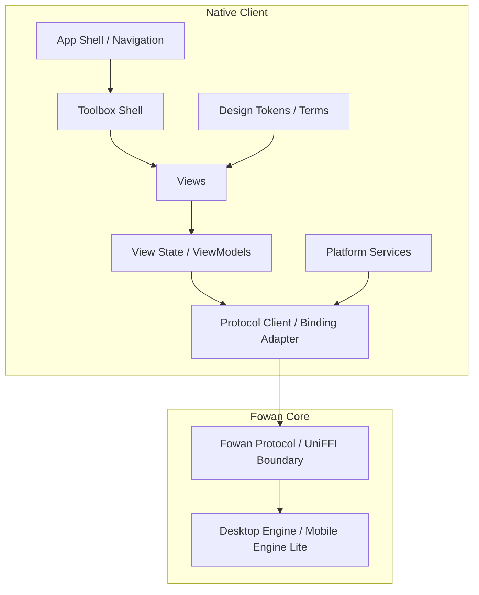

# Fowan 客户端通用功能设计

> 文档版本：v0.2 Draft
> 日期：2026-07-01
> 适用范围：Windows / macOS / iOS / Android 客户端通用功能
> 当前边界：[`repository_boundaries.md`](repository_boundaries.md)
> 历史架构草案：[`history/architecture/fowan_architecture_design_for_ai.md`](history/architecture/fowan_architecture_design_for_ai.md)
> 开闭源边界：`docs/repository_boundaries.md`
> Windows 首版 UI：`docs/windows_client_ui_design.md`

---

## 1. 文档定位

本文件提炼所有原生客户端都应遵守的通用功能设计，不绑定 Windows、macOS、iOS 或 Android 的具体 UI 技术。涉及 Fowan Protocol 或 Engine 的内容描述未来私有能力接入方式，不表示当前 Todo、Diary 等开源工具必须依赖 FowanCore；现有普通工具逻辑继续保留在公开 Shared 项目中。

客户端通用职责：

- 提供平台原生体验。
- 展示工具、业务对象和运行状态。
- 管理用户输入、导航和反馈。
- 通过 Fowan Protocol 或移动绑定调用核心能力。
- 处理平台权限入口。
- 接收核心事件并更新界面。
- 暴露诊断和恢复入口。

客户端不负责：

- 文件索引核心。
- 搜索排序和向量检索。
- AI 工作流编排。
- Plugin / Skill / MCP Runtime。
- 同步冲突合并。
- 授权核心算法。
- 直接访问 Engine SQLite、索引文件或内部 Rust 类型。

平台独占设计放在各平台 UI / 平台体验文档中。当前 Windows 首版见 `docs/windows_client_ui_design.md`。

---

## 2. 通用客户端架构



通用原则：

- UI 只依赖公开协议、SDK 或绑定。
- 业务事实来源来自 Core。
- 客户端可以缓存 UI 状态，但不能复制核心业务规则。
- 平台服务只做入口和适配，不实现核心算法。
- 所有能力由 capability handshake 决定是否展示。

---

## 3. 通用功能域

### 3.1 Toolbox

首个客户端通用壳层是 Toolbox。

Toolbox 的职责：

- 展示可用工具。
- 展示后续规划工具。
- 展示工具状态和依赖能力。
- 提供工具搜索。
- 提供工具分类。
- 提供 Settings 和 Diagnostics 入口。
- 为后续业务工具提供统一入口。

首版工具箱采用“少量可用 + 未来工具占位”。

可用基础入口：

```text
Toolbox Home
Quick Capture
Settings
Diagnostics
```

后续工具占位：

```text
Todo
Notes
Knowledge
Files / Indexing
Global Search
Workflows
AI
Plugins / MCP / Skill
Sync / Devices
```

### 3.2 Tool Model

通用工具模型：

```text
ToolCard
  - id
  - name
  - description
  - icon
  - category
  - status
  - version
  - updated_at
  - changelog
  - required_capabilities
  - primary_action
  - secondary_actions

ToolCategory
  - id
  - name
  - sort_order

ToolStatus
  - available
  - coming_soon
  - disabled
  - requires_engine
  - requires_sign_in

ToolAction
  - id
  - label
  - kind
  - enabled
  - disabled_reason
```

说明：

- Tool model 是客户端展示模型，不等同于核心业务对象。
- 未来可从本地配置、协议 capability 或远端配置组合生成。
- 首版可以先静态定义工具卡，再逐步接入协议能力。
- 工具箱和每个已打包工具都必须有独立版本号。工具卡详情必须展示当前版本和更新时间。
- 工具箱和每个已打包工具都必须维护内部 changelog，用于记录该组件每个版本的用户可见更新。

### 3.3 Quick Capture

Quick Capture 作为捕捉类工具卡保留，当前首版先禁用，后续再重新启用捕捉流程。

通用能力：

- 快速输入文本。
- 捕捉剪贴板内容。
- 保存最小 capture。
- 后续由具体工具完成归类。

首版不绑定 Todo、Notes、Files 或 Workflow。

### 3.4 Settings

通用设置能力：

- 主题：system / light / dark。
- 语言：system / zh-CN / en-US。
- 账户入口。
- 同步状态入口。
- 通知设置。
- 快捷入口设置，具体形式由平台决定。
- 数据和隐私入口。
- 诊断入口。

首版客户端必须支持主题切换和中英文切换。所有面向用户的导航、工具名、状态标签、按钮、错误信息和诊断字段都必须走本地化资源或等价机制。

### 3.5 Diagnostics

通用诊断能力：

- Client 版本。
- Core 版本。
- Protocol 版本。
- Capability 列表。
- 连接状态。
- 最近错误。
- 日志导出入口。
- 数据恢复入口。

### 3.6 Version and Changelog

版本和更新日志能力：

- 工具箱自身是一个可版本化组件。
- 每个随工具箱打包的内部工具也是独立可版本化组件。
- 工具箱版本和内部工具版本可以在首版保持一致，但模型必须允许后续拆分。
- 每个组件必须在仓库中维护内部 changelog，按版本记录本次新增、修复、迁移和用户可见行为变化。
- changelog 是打包和更新提示的来源，不应只写在提交信息或外部发布说明中。
- 打包安装包时，只能把当前安装包版本对应的更新日志段落写入安装包；不得把完整历史 changelog 全量打包给用户。
- 客户端或安装器展示更新说明时，应只展示本次版本更新内容。首次安装不展示更新说明。

---

## 4. 后续独立功能域

以下能力不进入首版工具箱可用流程，但作为客户端通用功能规划保留：

```text
Todo
Notes
Knowledge
Files / Indexing
Global Search
Workflows
AI
Plugins / MCP / Skill
Sync / Devices
License
```

接入原则：

- 每个能力域先作为工具卡进入工具箱。
- 成熟后再拥有独立工作区。
- 不把所有能力塞进首页。
- 通过 link / convert / reference 建立对象关系。
- UI 只发起协议调用，不实现核心业务算法。

---

## 5. 通用对象视图

### 5.1 Toolbox + Workspace

桌面端优先使用工具箱 + 工作区结构：

```text
Navigation / Categories
  -> Tool Grid
  -> Tool Detail or Tool Workspace
```

移动端优先使用 drill-down：

```text
Toolbox
  -> Tool List
  -> Tool Workspace
```

### 5.2 Quick Add / Capture

通用概念：

- 当前上下文快速输入。
- 全局快速捕捉。
- 默认落点。
- 最小输入。
- 后续补充详情。

首版 Quick Capture 不决定业务对象类型。

### 5.3 Empty / Loading / Error

所有客户端必须提供：

- 首次加载状态。
- 局部保存状态。
- 空状态。
- 连接中断状态。
- Core 降级状态。
- 可重试错误。
- 可复制诊断信息。

---

## 6. Protocol Client / Binding Adapter

桌面客户端：

- 通过 Fowan Protocol 与 Desktop Engine 通信。
- 使用平台 IPC transport。
- 接收 event stream。
- 进行 version / capability handshake。

移动客户端：

- 通过 UniFFI 调用 Mobile Engine Lite。
- 与 Cloud 使用 HTTPS / WebSocket。
- 仍复用 protocol DTO 和 capability model。

通用接口：

```text
IAppApi
ISettingsApi
IWorkspaceApi
ITaskApi
INoteApi
IKnowledgeApi
IFileApi
IIndexApi
ISearchApi
IWorkflowApi
IAiApi
IPluginApi
ISyncApi
IDeviceApi
ILicenseApi
IDiagnosticsApi
```

首版工具箱客户端只需要启用与 App / Settings / Diagnostics / Quick Capture 相关的子集。

---

## 7. Capability 驱动 UI

客户端启动后必须获取：

```text
app.health
app.version
app.capabilities
```

UI 展示规则：

- capability 不存在时，对应工具显示 Coming Soon 或 Disabled。
- capability 降级时，显示明确状态。
- 新能力不能靠客户端硬编码假装存在。
- 客户端可展示未来工具卡，但不能让用户进入不可用核心流程。

---

## 8. 客户端状态管理

状态来源：

- Core query response。
- Core event stream。
- 平台 activation。
- 本地 UI transient state。

原则：

- 权威业务状态来自 Core。
- 客户端缓存只用于体验优化。
- Event stream 更新当前视图。
- 断线后重新 query 当前页面。
- 冲突、同步和授权状态由 Core 建模，客户端只展示和收集用户决策。

---

## 9. 安全边界

客户端可以：

- 收集用户输入。
- 发起平台权限申请。
- 触发核心协议调用。
- 展示授权、同步、隐私状态。
- 使用平台安全存储入口保存客户端需要的短期状态，具体策略由核心安全设计约束。

客户端不可以：

- 明文保存长期 token。
- 内置私有 API key。
- 持有授权判定核心。
- 直接读取或修改核心数据库。
- 复制搜索、索引、AI 编排、同步冲突逻辑。

---

## 10. 通用可访问性

所有客户端应支持：

- 键盘或平台等效导航。
- 屏幕阅读器。
- 系统字号。
- 高对比度或平台等效无障碍模式。
- 图标按钮的可访问名称。
- 颜色之外的状态表达。
- 焦点顺序和对话框焦点管理。
- 工具状态可被辅助技术读出。

---

## 11. 通用测试策略

```text
Contract tests:
  - protocol examples
  - schema roundtrip
  - event compatibility

State tests:
  - capability gating
  - reconnect
  - event update
  - error mapping

Feature tests:
  - tool card status
  - tool category filtering
  - quick capture
  - settings persistence
  - diagnostics export

Platform tests:
  - activation
  - notification
  - permission entry
  - secure storage adapter
```

平台测试细节进入各平台文档。

---

## 12. 与核心架构的关系

客户端通用设计依赖核心架构提供：

- Fowan Protocol。
- SDK / binding。
- capability list。
- event schema。
- error schema。
- Engine lifecycle contract。
- diagnostics contract。

核心架构不能要求客户端：

- 链接 Rust 内部 crate。
- 访问 SQLite。
- 解析索引文件。
- 复制 workflow 调度逻辑。

客户端可以为核心提供：

- 用户交互。
- 权限入口。
- 当前平台上下文。
- 通知激活。
- 用户可见的确认和授权。

---

## 13. 与平台 UI 文档的关系

本文档回答：“所有客户端共同要做什么？”

平台 UI 文档回答：

- 这个平台如何布局？
- 这个平台使用什么原生控件？
- 这个平台有哪些系统入口？
- 这个平台的首版视觉和交互是什么？
- 这个平台有哪些独占能力？

当前 Windows 平台文档：

- `docs/windows_client_ui_design.md`
