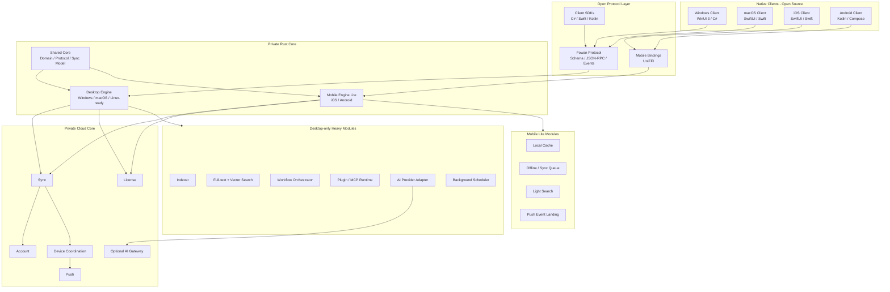

# Fowan 跨平台核心架构设计

> 文档版本：v0.1 Draft
> 日期：2026-06-29
> 适用范围：Fowan Protocol、Rust Core Engine、Mobile Engine Lite、Cloud Core
> 全局架构：`docs/fowan_architecture_design_for_ai.md`
> 客户端通用功能：`docs/client_common_function_design.md`
> Windows 首版 UI：`docs/windows_client_ui_design.md`

---

## 1. 文档定位

本文件设计 Fowan 的核心部分，并直接按照未来跨平台模式设计。

核心部分包括：

- Fowan Protocol。
- Rust shared domain。
- Desktop Engine。
- Mobile Engine Lite。
- Storage / Blob / Index。
- Search / Vector retrieval。
- AI Provider。
- Workflow Orchestrator。
- Plugin / Skill / MCP Runtime。
- Sync Core。
- Account / Device / License / Cloud integration。
- Security / Observability。

核心部分不绑定 Windows。Windows、macOS、iOS、Android 都必须通过稳定协议或绑定访问核心能力。

---

## 2. 跨平台核心总体架构



---

## 3. 跨平台分层

```text
Layer 1: Native Experience
  - Windows Client
  - macOS Client
  - iOS Client
  - Android Client

Layer 2: Public Contract
  - Fowan Protocol
  - schema
  - events
  - SDKs
  - capability model

Layer 3: Rust Shared Core
  - domain
  - protocol DTO mapping
  - sync model
  - storage traits
  - AI traits
  - workflow model

Layer 4: Runtime Engines
  - Desktop Engine sidecar/daemon
  - Mobile Engine Lite embedded library
  - CLI and automation host

Layer 5: Infrastructure
  - SQLite
  - blob store
  - search index
  - vector index
  - cloud services
  - OS-specific adapters
```

---

## 4. 核心仓库结构

```text
engine-private/
  Cargo.toml

  crates/
    fowan-domain/
    fowan-protocol/
    fowan-capabilities/

    fowan-storage-core/
    fowan-storage-sqlite/
    fowan-blob-store/

    fowan-sync-core/
    fowan-sync-client/

    fowan-ai-core/
    fowan-workflow/
    fowan-search/
    fowan-vector/
    fowan-indexer/
    fowan-extractors/

    fowan-plugin-runtime/
    fowan-mcp-bridge/
    fowan-scheduler/

    fowan-security/
    fowan-license/
    fowan-device/
    fowan-observability/

    fowan-desktop-engine/
    fowan-mobile-engine-lite/
    fowan-daemon/
    fowan-cli/
    fowan-bindings/

  migrations/
  schemas/
  testdata/
```

开放协议仓库或目录：

```text
protocol/
  schema/
  events/
  jsonrpc/
  sdk/
    csharp/
    swift/
    kotlin/
  examples/
  docs/
```

---

## 5. Fowan Protocol

### 5.1 协议原则

- 协议开源。
- 语义稳定优先。
- 客户端不依赖闭源内部模型。
- 所有 API 包含 request、response、error、event。
- 所有 capability 可查询。
- breaking change 必须升级 major 并进入 ADR。

### 5.2 协议域

```text
app.*
settings.*
workspace.*
note.*
task.*
knowledge.*
file.*
index.*
search.*
workflow.*
ai.*
plugin.*
sync.*
device.*
license.*
diagnostics.*
```

### 5.3 Transport

Desktop：

- Windows：Named Pipe。
- macOS：Unix Domain Socket。
- Linux-ready：Unix Domain Socket。
- fallback：localhost HTTP/WebSocket，默认关闭或开发者模式开启。

Mobile：

- UniFFI binding。
- 内部仍复用 protocol DTO 和 domain model。
- 与 Cloud 使用 HTTPS/WebSocket。

Cloud：

- REST for account/license/config。
- batch sync API。
- WebSocket for device events and remote trigger。

Plugin：

- stdio。
- local pipe/socket。
- MCP transport adapter。

---

## 6. Domain Model

核心对象：

```text
Workspace
Note
Task
KnowledgeItem
FileRef
Attachment
Workflow
WorkflowRun
StepRun
ToolInvocation
Device
SyncChange
Plugin
AiInvocation
LicenseState
Setting
Event
```

建模原则：

- 核心对象归属 Workspace。
- 稳定 ID。
- UTC 时间。
- 软删除。
- source/source_uri。
- version/revision。
- sync metadata。
- AI 生成内容必须有来源标识。

---

## 7. Desktop Engine

Desktop Engine 是完整能力端，运行于：

- Windows。
- macOS。
- Linux-ready for future automation/server-like local agent。

职责：

- 本地持久化。
- 本地文件索引。
- 全文搜索。
- 向量检索。
- AI Provider 调用。
- Workflow Orchestrator。
- Plugin / Skill / MCP Runtime。
- 后台任务调度。
- 同步客户端。
- 授权校验。
- 本地事件流。
- 诊断和日志。

运行形态：

```text
Native Desktop Client
  -> OS IPC
  -> fowan-daemon
  -> fowan-desktop-engine
  -> storage / index / cloud / plugin
```

Desktop Engine 不依赖具体 UI 框架。

---

## 8. Mobile Engine Lite

Mobile Engine Lite 是轻量核心，运行于：

- iOS。
- Android。

职责：

- domain model 复用。
- 本地缓存。
- 离线编辑队列。
- 同步队列。
- 轻量搜索。
- 本地加密。
- 推送事件落地。
- 远程触发桌面工作流。

不负责：

- 全量桌面文件索引。
- 长时间后台 Agent。
- 完整 MCP Runtime。
- 大规模向量库。
- 复杂本地 workflow 执行。

运行形态：

```text
iOS / Android Client
  -> Swift / Kotlin binding
  -> UniFFI
  -> fowan-mobile-engine-lite
  -> local cache / sync cloud
```

---

## 9. Storage 与 Blob

### 9.1 Storage Core

`fowan-storage-core` 定义 repository trait 和 transaction boundary。

`fowan-storage-sqlite` 提供默认实现：

- desktop local database。
- mobile cache database。
- migration。
- WAL。
- backup。
- integrity check。

### 9.2 Blob Store

Blob 存储：

- attachments。
- thumbnails。
- extracted text。
- workflow artifacts。
- generated files。

原则：

- SQLite 保存元数据和引用。
- Blob 使用 content-addressed storage。
- Search index 和 vector index 是可重建派生数据。

### 9.3 平台数据位置

平台适配层决定路径：

```text
Windows:
  %LOCALAPPDATA%\Fowan\

macOS:
  ~/Library/Application Support/Fowan/

iOS:
  App container

Android:
  App-specific storage
```

---

## 10. Indexer 与 Extractors

Indexer 是 Desktop-only heavy module。

职责：

- 用户索引范围管理。
- 初次 crawl。
- 文件变化监听。
- 文件类型过滤。
- 元数据读取。
- 内容抽取调度。
- OCR 调度。
- extracted text 写入 blob。
- Search / Vector index 更新。

平台适配：

```text
Windows:
  ReadDirectoryChangesW / future USN Journal

macOS:
  FSEvents

Linux-ready:
  inotify
```

Extractor 运行策略：

- 独立 worker。
- 单文件失败隔离。
- timeout。
- size limit。
- error event。

---

## 11. Search 与 Vector

搜索分层：

```text
Structured Search:
  Note / Task / Knowledge / Workflow

Full-text Search:
  extracted local files
  metadata
  content snippets

Vector Search:
  semantic retrieval
  knowledge embeddings
  file embeddings

AI-assisted Retrieval:
  query rewrite
  summarization
  answer with citations
```

原则：

- Client 不实现 ranking。
- Search result 包含 source、score、snippet、explanation。
- 向量索引可插拔。
- AI 上下文必须可追踪。

---

## 12. AI Core

`fowan-ai-core` 定义 provider interface：

```text
chat
summarize
embed
classify
extract
transcribe
tool_call
rerank
```

Provider 类型：

- Cloud LLM API。
- Local model。
- Enterprise private model。
- Fowan AI Gateway。
- User-defined provider。

AI 调用记录：

- provider。
- model。
- capability。
- workspace。
- input source summary。
- whether file content was sent。
- token / cost estimate。
- started_at / completed_at。
- status。

---

## 13. Workflow Orchestrator

Workflow 是核心闭源能力。

对象：

```text
WorkflowTemplate
WorkflowRun
StepRun
ToolInvocation
Artifact
Checkpoint
```

能力：

- 多步骤任务。
- 搜索调用。
- 文件索引调用。
- AI 调用。
- Plugin / MCP 工具调用。
- 等待用户确认。
- 可暂停、取消、恢复。
- 持久化运行状态。
- 崩溃恢复。
- 移动端远程触发桌面执行。

---

## 14. Plugin / Skill / MCP Runtime

Runtime 是 Desktop-only heavy module，协议和 manifest 可公开。

Manifest：

```text
id
name
version
publisher
entrypoint
capabilities
permissions
supported_platforms
configuration_schema
```

权限：

```text
file.read
file.write
network
clipboard
notification
ai.invoke
workspace.read
workspace.write
shell.execute
```

原则：

- 插件不直接访问数据库。
- 插件通过 tool/protocol API 访问能力。
- 高风险插件独立 host。
- 权限可见、可撤销。
- MCP 通过 adapter 接入 workflow runtime。

---

## 15. Sync Core 与 Cloud

### 15.1 Sync Core

职责：

- 本地 change log。
- 增量上传。
- 远端变更拉取。
- merge policy。
- conflict model。
- offline queue。
- device metadata。

MVP 策略：

- object-level merge。
- last-write-wins。
- conflict prompt。

后续：

- field-level merge。
- CRDT/OT。
- E2EE。
- partial sync。

### 15.2 Cloud Core

服务：

```text
account-service
sync-service
device-service
push-service
license-service
ai-gateway
```

设备协同：

- mobile capture -> desktop process -> mobile result。
- mobile remote trigger -> desktop workflow -> push result。
- desktop artifact -> mobile notification。

---

## 16. License 与 Capability

License core 负责：

- entitlement。
- offline grace。
- feature gate。
- plan capability。
- device limit。
- enterprise policy。

Client 只能展示状态和触发激活，不持有授权判定核心。

Capability 统一表达：

```json
{
  "engine_version": "0.1.0",
  "protocol_version": "0.1",
  "platform": "windows",
  "capabilities": [
    "note.create",
    "search.query",
    "index.start",
    "workflow.run"
  ]
}
```

---

## 17. Security

本地安全：

- 当前用户权限运行。
- IPC 限制当前用户。
- Secret 使用平台安全存储。
- 数据库加密预留。
- Blob 加密预留。
- 日志默认不记录正文。

平台 secret adapter：

```text
Windows:
  Credential Manager / DPAPI

macOS / iOS:
  Keychain

Android:
  Android Keystore
```

AI 隐私：

- 明确本地/云端处理。
- AI invocation 可追踪。
- 目录级 AI 排除规则。
- 企业策略可禁用云端 AI。

Plugin 安全：

- manifest 权限。
- runtime 审计。
- 独立 host。
- secret 不暴露给插件。

---

## 18. Observability

核心模块统一输出：

- structured logs。
- trace id。
- method。
- duration。
- error name。
- component。
- workspace id。

事件链路：

```text
client action
  -> protocol request
  -> engine service
  -> storage/search/ai/plugin/cloud
  -> event/response
```

诊断能力：

- logs tail。
- diagnostics export。
- health report。
- migration status。
- index status。
- sync status。
- workflow status。

---

## 19. Cross-platform Runtime Matrix

| 能力 | Windows Desktop | macOS Desktop | iOS | Android |
|---|---|---|---|---|
| Native UI | WinUI 3 | SwiftUI | SwiftUI | Compose |
| Core access | IPC | IPC | UniFFI | UniFFI |
| Full Desktop Engine | Yes | Yes | No | No |
| Mobile Engine Lite | No | No | Yes | Yes |
| File Indexing | Yes | Yes | No | No |
| Full-text Search | Yes | Yes | Light cache only | Light cache only |
| Vector Search | Yes | Yes | Remote/cache only | Remote/cache only |
| Workflow Execution | Full | Full | Trigger/view | Trigger/view |
| Plugin/MCP Runtime | Full | Full | No | No |
| Sync | Yes | Yes | Yes | Yes |
| Push Landing | Optional | Optional | Yes | Yes |

---

## 20. 与客户端文档的关系

本核心架构为 Toolbox-first 的通用客户端功能设计提供：

- protocol schema。
- typed SDK contract。
- capability list。
- event schema。
- error schema。
- Engine lifecycle contract。
- diagnostics contract。

客户端为核心提供：

- 用户交互。
- 权限入口。
- 文件选择。
- 系统通知。
- 快捷键入口。
- Shell context。
- 工具卡 capability 展示和用户可见状态。

其他平台客户端也应遵守同样边界：平台负责体验和系统集成，核心负责业务能力。

---

## 21. 实施阶段建议

```text
Phase 1:
  Protocol v0.1 + Desktop Engine sidecar skeleton + Windows client MVP + SQLite

Phase 2:
  Desktop daemon hardening + file indexing + search

Phase 3:
  Sync server + account + device coordination + Mobile Engine Lite skeleton

Phase 4:
  iOS client + Android client + mobile capture/sync

Phase 5:
  AI provider + workflow orchestrator

Phase 6:
  Plugin / Skill / MCP runtime

Phase 7:
  enterprise security, deployment, observability hardening
```

阶段只表示实现顺序，不改变完整核心架构。

---

## 22. 官方参考

- [Mozilla UniFFI](https://mozilla.github.io/uniffi-rs/)
- [Tokio Windows named pipe](https://docs.rs/tokio/latest/tokio/net/windows/named_pipe/)
- [SQLx SQLite](https://docs.rs/sqlx/latest/sqlx/sqlite/)
- [Tantivy](https://docs.rs/tantivy/)
- [Windows Named Pipes](https://learn.microsoft.com/en-us/windows/win32/ipc/named-pipes)
- [Apple Keychain Services](https://developer.apple.com/documentation/security/keychain_services)
- [Android Keystore system](https://developer.android.com/privacy-and-security/keystore)
