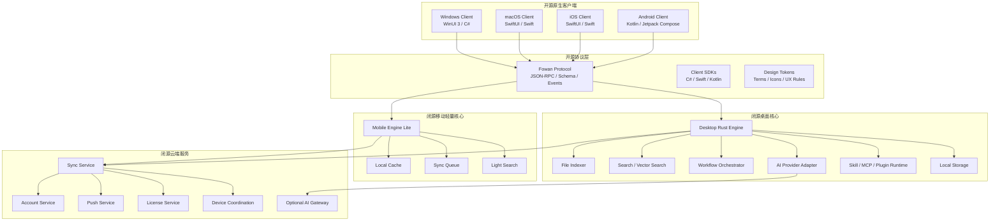

# Fowan（伏案）多端原生架构设计文档

> **文档定位**：本文件主要面向 AI Agent / AI Coding Assistant / 架构生成器阅读，其次面向人类工程师阅读。
> **产品中文名**：伏案
> **产品英文名**：Fowan
> **展开句**：Fowan Orchestrates Workflows with AI, Natively.
> **文档版本**：v0.1 Draft
> **日期**：2026-06-29
> **核心决策**：四端客户端开源，核心能力闭源；客户端坚持平台原生体验；核心能力由 Rust Engine 提供。

---

## 0. AI 读取摘要

如果你是 AI，请优先遵守本节。本节是 Fowan 当前架构的不可变约束。

### 0.1 架构一句话

Fowan 是一个多端原生 AI 工作流办公系统，由开源的四端原生客户端、闭源 Rust 核心 Engine、公开协议层、以及闭源同步/账号/授权服务组成。

### 0.2 不可变设计约束

1. **四端客户端可以开源**：Windows、macOS、iOS、Android 客户端均可开源。
2. **核心能力闭源**：文件索引、AI 工作流编排、高级检索、授权、同步核心、商业能力等放在闭源 Rust Engine / Server 中。
3. **客户端只负责体验层和平台集成**：UI、窗口、系统权限、快捷键、通知、分享入口、菜单栏、托盘等属于客户端职责。
4. **业务核心不能沉入 UI 客户端**：任务、笔记、知识对象、工作流、搜索、同步冲突处理等必须在 Engine / Protocol / Server 层建模。
5. **桌面端是完整能力端**：Windows 和 macOS 可以运行完整 Desktop Engine，支持本地文件索引、长时间后台任务、插件/MCP/Skill、本地知识库和复杂工作流。
6. **手机端是轻量随身端**：iOS 和 Android 不运行完整桌面 Engine，只运行 Mobile Engine Lite，用于快速记录、查看、轻量搜索、同步、推送、分享入口和远程触发桌面工作流。
7. **桌面端 Engine 优先以本地 sidecar/daemon 进程运行**，客户端通过 IPC 调用，不建议 UI 直接深度链接 Rust 内部结构。
8. **移动端 Engine Lite 优先以嵌入式 Rust 库运行**，通过 UniFFI 暴露 Swift / Kotlin 绑定。
9. **协议优先**：所有客户端与核心能力交互必须通过 Fowan Protocol，不允许直接依赖闭源 Engine 内部模型。
10. **体验风格为“品牌一致，平台原生”**：不要追求四端像素级一致，而是保证信息架构、术语、图标、品牌色、核心交互一致。

### 0.3 禁止事项

AI 或工程实现时不要做以下事情：

- 不要把 Windows、macOS、iOS、Android 做成同一套 WebView 壳。
- 不要让客户端直接访问闭源 Engine 的内部数据库结构。
- 不要把文件索引、向量检索、工作流编排等核心能力写在开源客户端里。
- 不要在手机端实现完整本地文件索引、长期常驻 Agent、完整 MCP Runtime 或大规模向量库。
- 不要让 UI 客户端之间共享同一套像素级 UI 组件；应共享协议、术语、设计 token 和交互原则。
- 不要将 GPL/AGPL 代码引入需要与闭源核心强绑定的客户端或协议层，除非经过法律评估。

---

## 1. 产品定位

### 1.1 产品名

- 中文名：伏案
- 英文名：Fowan
- 展开句：Fowan Orchestrates Workflows with AI, Natively.

### 1.2 定位

Fowan 是一个原生多端 AI 办公助手，面向个人和团队的桌面/移动工作流场景，核心能力包括：

- 待办记录与管理
- 知识点记录与组织
- 本地文件查找与索引
- AI 辅助总结、检索、编排
- 多设备同步
- 手机端快速采集与桌面端深度处理
- 后续扩展 Skill / MCP / Plugin 能力

### 1.3 产品形态

Fowan 不是单纯的网页 SaaS，也不是单一桌面工具，而是：

```text
多端原生客户端 + 本地 Rust Engine + 云端同步服务 + AI 工作流核心
```

---

## 2. 总体架构

### 2.1 总览图



### 2.2 分层架构

```text
Layer 1: Native Clients
  - Windows: WinUI 3 / C#
  - macOS: SwiftUI / Swift
  - iOS: SwiftUI / Swift
  - Android: Kotlin / Jetpack Compose

Layer 2: Open Protocol & SDK
  - Fowan Protocol
  - JSON-RPC schema
  - Event schema
  - Client SDK wrappers
  - Design tokens and shared terminology

Layer 3: Closed Local Engine
  - Desktop Rust Engine
  - Mobile Engine Lite

Layer 4: Closed Cloud Services
  - Account
  - Sync
  - Push
  - License
  - Device Coordination
  - Optional AI Gateway
```

---

## 3. 技术选型总表

| 层级 | 平台/模块 | 技术选型 | 开源策略 | 说明 |
|---|---|---|---|---|
| Windows 客户端 | Windows 10/11+ | WinUI 3 + C# + Windows App SDK | 开源 | 原生 Windows 体验，负责窗口、托盘、通知、快捷键、权限等 |
| macOS 客户端 | macOS | SwiftUI + Swift + AppKit Bridge | 开源 | 原生 macOS 体验，负责菜单栏、Dock、权限、通知、快捷键等 |
| iOS 客户端 | iPhone/iPad | SwiftUI + Swift | 开源 | 快速记录、分享入口、查看、推送、轻量搜索 |
| Android 客户端 | Android | Kotlin + Jetpack Compose | 开源 | 快速记录、通知、分享入口、离线缓存、轻量搜索 |
| 桌面核心 | Windows/macOS/Linux 可扩展 | Rust + Tokio | 闭源 | 完整本地能力端，负责索引、搜索、AI、工作流、插件等 |
| 移动核心 | iOS/Android | Rust Mobile Engine Lite + UniFFI | 闭源 | 移动端轻量核心，负责缓存、同步队列、轻量搜索、加密等 |
| 桌面通信 | Windows/macOS | IPC：Named Pipe / Unix Domain Socket / localhost fallback | 协议开源，实现闭源 | UI 与 Engine 解耦，避免 UI 崩溃被 Engine 拖死 |
| 移动绑定 | iOS/Android | UniFFI -> Swift/Kotlin | 绑定可部分开源，核心闭源 | 复用 Rust 业务逻辑，避免 Swift/Kotlin 双份实现 |
| 本地存储 | Desktop/Mobile | SQLite | 实现闭源 | 任务、笔记、配置、同步状态、缓存 |
| 全文搜索 | Desktop | Tantivy / SQLite FTS 混合 | 实现闭源 | 桌面端负责大规模本地索引 |
| 向量检索 | Desktop 优先 | 可插拔向量索引 | 闭源 | MVP 可延后 |
| 云端 | Server | Rust / Go / TypeScript 均可，建议 Rust/Go | 闭源 | 同步、账号、授权、推送、设备协同 |
| 协议 | 全端 | JSON-RPC MVP，后续 Protobuf/MessagePack | 开源 | AI 和第三方集成优先读协议 |

---

## 4. 开源与闭源边界

### 4.1 开源模块

建议开源以下仓库或目录：

```text
apps/
  windows/
  macos/
  ios/
  android/

fowan-protocol/
  schema/
  events/
  sdk/
  examples/
  docs/

fowan-design/
  tokens/
  icons/
  ux-guidelines/
  terminology/
```

开源内容包括：

- 原生客户端 UI
- View / ViewModel / Platform Services
- 客户端与 Engine 的协议调用封装
- 公开数据 schema
- 事件 schema
- 插件/Skill/MCP 接入协议
- 主题、图标、设计 token
- 示例扩展与示例插件
- 人类与 AI 可读文档

### 4.2 闭源模块

建议闭源以下仓库或目录：

```text
fowan-engine-private/
  desktop-engine/
  mobile-engine-lite/
  indexer/
  search/
  workflow/
  ai/
  license/
  sync-core/

fowan-cloud-private/
  account/
  sync/
  push/
  license/
  device/
  ai-gateway/
```

闭源内容包括：

- 本地文件索引策略
- 高级搜索与向量检索实现
- AI 工作流编排器
- 本地 Agent / Skill / MCP Runtime
- 授权系统
- 同步冲突解决核心
- 商业功能开关
- 云端同步实现
- AI Provider 高级调度策略

### 4.3 协议开源但实现闭源

Fowan Protocol 应该开源，便于：

- 客户端透明调用
- 第三方插件开发
- AI Coding Assistant 理解接口边界
- 降低社区贡献门槛

但协议背后的能力实现可以保持闭源。

### 4.4 开源协议建议

初步建议：

- 客户端：MPL-2.0 或 Apache-2.0
- 协议与 schema：Apache-2.0 或 MIT
- 示例插件：Apache-2.0 / MIT
- 闭源 Engine：商业私有协议

说明：若闭源核心需要与开源客户端同时分发，应避免使用可能强制传染闭源核心的许可证。最终许可证需要经过法律评估。

---

## 5. 客户端架构

### 5.1 Windows Client

```text
Technology:
  - C#
  - WinUI 3
  - Windows App SDK
  - MVVM

Responsibilities:
  - 原生窗口与布局
  - Fluent 风格视觉体验
  - 系统托盘
  - 全局快捷键
  - Windows 通知
  - 文件选择器与权限入口
  - 启停 Desktop Engine sidecar
  - 调用 Fowan Protocol

Non-responsibilities:
  - 不实现本地文件索引核心
  - 不实现 AI 工作流编排
  - 不直接读写 Engine 内部数据库
  - 不持有商业授权核心逻辑
```

建议目录：

```text
apps/windows/
  Fowan.Windows.csproj
  App.xaml
  MainWindow.cs
  Models/
  Services/
  Resources/
  Assets/
  EngineBridge/
  README.md
```

### 5.2 macOS Client

```text
Technology:
  - Swift
  - SwiftUI
  - AppKit Bridge where needed

Responsibilities:
  - 原生窗口与多窗口管理
  - macOS 菜单栏
  - Dock 行为
  - Menu Bar Extra
  - 系统通知
  - 快捷键
  - 文件访问权限申请
  - 启停 Desktop Engine sidecar
  - 调用 Fowan Protocol

Non-responsibilities:
  - 不实现桌面文件索引核心
  - 不实现复杂工作流编排
  - 不绕过 Fowan Protocol 访问 Engine
```

建议目录：

```text
clients/macos-swiftui/
  Fowan/
    Views/
    Models/
    Services/
    EngineBridge/
    Assets/
  FowanDesignSystem/
  FowanProtocolClient/
  README.md
```

### 5.3 iOS Client

```text
Technology:
  - Swift
  - SwiftUI
  - Swift Concurrency
  - Share Extension
  - Widgets / App Intents 可后续加入

Responsibilities:
  - 快速记录
  - 查看待办、笔记、知识点
  - 手机端轻量搜索
  - 分享入口：网页、文本、图片、文件
  - 拍照/截图入库
  - 语音输入入口
  - 接收推送通知
  - 远程触发桌面工作流
  - 通过 UniFFI 调用 Mobile Engine Lite

Non-responsibilities:
  - 不运行完整 Desktop Engine
  - 不做全量本地文件索引
  - 不做长期后台 Agent
  - 不做完整 MCP Runtime
```

建议目录：

```text
clients/ios-swiftui/
  FowanIOS/
    Views/
    Models/
    Services/
    EngineBridge/
    ShareExtension/
    Widgets/
    Assets/
  FowanMobileProtocol/
  README.md
```

### 5.4 Android Client

```text
Technology:
  - Kotlin
  - Jetpack Compose
  - Coroutines / Flow
  - WorkManager
  - Room 或 SQLite wrapper

Responsibilities:
  - 快速记录
  - 查看待办、笔记、知识点
  - 分享入口
  - 通知栏入口
  - 离线缓存
  - 手机端轻量搜索
  - 接收推送通知
  - 远程触发桌面工作流
  - 通过 UniFFI 调用 Mobile Engine Lite

Non-responsibilities:
  - 不运行完整 Desktop Engine
  - 不做桌面级文件索引
  - 不做长期常驻 Agent
  - 不做完整 MCP Runtime
```

建议目录：

```text
clients/android-compose/
  app/
    ui/
    viewmodel/
    service/
    enginebridge/
    share/
    notification/
  fowan-mobile-protocol/
  README.md
```

---

## 6. Rust Engine 架构

### 6.1 Engine 分层

Rust Engine 需要拆成可复用的模块，而不是单体库。

```text
engine/
  crates/
    fowan-domain/             # 领域模型：Note, Task, Workflow, KnowledgeItem 等
    fowan-protocol/           # 协议模型与序列化
    fowan-storage-core/       # 存储抽象
    fowan-sync-core/          # 同步算法与冲突解决
    fowan-ai-core/            # AI Provider 抽象
    fowan-desktop-engine/     # 桌面完整能力
    fowan-mobile-engine-lite/ # 移动轻量能力
    fowan-indexer/            # 桌面文件索引
    fowan-search/             # 全文搜索/向量搜索
    fowan-workflow/           # 工作流编排
    fowan-plugin-runtime/     # Skill / MCP / Plugin Runtime
    fowan-license/            # 授权与功能开关
    fowan-daemon/             # 桌面 sidecar/daemon
    fowan-cli/                # 调试/自动化 CLI
    fowan-bindings/           # UniFFI/C ABI/C# binding 等
```

### 6.2 Desktop Engine

Desktop Engine 是完整能力端。

职责：

- 本地文件索引
- 本地全文搜索
- 向量检索
- 工作流编排
- AI Provider 调用
- 插件/Skill/MCP Runtime
- 本地数据存储
- 后台任务调度
- 同步客户端
- 授权校验
- 本地事件流

运行方式：

```text
Windows/macOS Client
  -> EngineBridge
  -> IPC
  -> fowan-engine sidecar/daemon
  -> local database / index / sync
```

优先采用 sidecar/daemon，而非直接动态库绑定。

原因：

- 崩溃隔离
- 后台任务更自然
- UI 与核心生命周期解耦
- CLI、浏览器扩展、插件可复用本地 API
- 更适合文件索引和长任务

### 6.3 Mobile Engine Lite

Mobile Engine Lite 是移动端轻量核心。

职责：

- 领域模型复用
- 本地缓存
- 离线编辑队列
- 同步队列
- 轻量搜索
- 本地加密
- 协议序列化
- 推送事件落地
- 移动端任务状态管理

不负责：

- 全量文件索引
- 桌面级插件 Runtime
- 长时间后台 Agent
- 大规模向量索引
- 本地复杂模型推理

运行方式：

```text
iOS/Android Client
  -> Swift/Kotlin binding
  -> UniFFI
  -> Rust Mobile Engine Lite
  -> local cache / sync server
```

---

## 7. 通信协议设计

### 7.1 协议原则

Fowan Protocol 是所有客户端与 Engine / Cloud 交互的唯一稳定边界。

原则：

1. 协议开源。
2. 协议版本化。
3. 协议稳定优先于内部实现。
4. 客户端不得依赖闭源 Engine 的内部模块名、数据库表结构或 Rust 类型。
5. MVP 使用 JSON-RPC，后续可升级为 Protobuf / MessagePack，但语义模型保持稳定。

### 7.2 请求示例

```json
{
  "jsonrpc": "2.0",
  "id": "req_001",
  "method": "workflow.run",
  "params": {
    "workflow_id": "wf_weekly_report",
    "input": {
      "source": "clipboard",
      "language": "zh-CN"
    }
  }
}
```

### 7.3 响应示例

```json
{
  "jsonrpc": "2.0",
  "id": "req_001",
  "result": {
    "run_id": "run_20260629_001",
    "status": "running"
  }
}
```

### 7.4 事件示例

```json
{
  "event": "workflow.output.delta",
  "payload": {
    "run_id": "run_20260629_001",
    "text": "已整理完成 3 个模块的周报草稿。"
  }
}
```

### 7.5 MVP 方法清单

```text
app.health
app.version
settings.get
settings.set
note.create
note.update
note.search
task.create
task.update
task.list
knowledge.capture
search.query
workflow.run
workflow.cancel
workflow.status
index.start
index.pause
index.status
sync.status
sync.force
device.list
device.trigger
ai.chat
ai.summarize
```

### 7.6 MVP 事件清单

```text
app.ready
engine.started
engine.stopped
index.progress
index.completed
index.error
search.completed
workflow.started
workflow.output.delta
workflow.completed
workflow.error
sync.started
sync.completed
sync.conflict
license.changed
device.online
device.offline
```

---

## 8. 数据模型

### 8.1 核心对象

```text
Workspace
  - id
  - name
  - owner_id
  - created_at
  - updated_at

Note
  - id
  - workspace_id
  - title
  - content
  - tags
  - source
  - created_at
  - updated_at

Task
  - id
  - workspace_id
  - title
  - description
  - status
  - due_at
  - priority
  - linked_notes
  - created_at
  - updated_at

KnowledgeItem
  - id
  - workspace_id
  - type
  - title
  - content
  - source_uri
  - embedding_ref
  - created_at
  - updated_at

FileRef
  - id
  - device_id
  - path
  - hash
  - metadata
  - indexed_at

Workflow
  - id
  - name
  - description
  - steps
  - required_capabilities
  - created_at
  - updated_at

WorkflowRun
  - id
  - workflow_id
  - status
  - input
  - output
  - logs
  - started_at
  - completed_at

Device
  - id
  - user_id
  - name
  - platform
  - capabilities
  - last_seen_at

SyncChange
  - id
  - object_type
  - object_id
  - operation
  - payload
  - device_id
  - created_at
```

### 8.2 对象建模原则

- 所有核心对象应归属于 Workspace。
- 所有对象必须有稳定 ID。
- 所有对象必须有 created_at / updated_at。
- 支持软删除。
- 支持来源追踪 source/source_uri。
- 支持跨设备同步元数据。
- 任何 AI 生成内容都应标记生成来源和时间。

---

## 9. 同步与云端服务

### 9.1 必须有云端服务

当 Fowan 加入手机端后，必须具备同步服务。否则手机端只能成为孤立客户端，无法承接“随身入口 + 桌面重能力”的产品定位。

### 9.2 云端服务模块

```text
cloud/
  account-service/
  sync-service/
  push-service/
  license-service/
  device-service/
  ai-gateway/       # 可选
```

职责：

- 账号注册/登录
- 设备绑定
- 数据同步
- 推送通知
- 授权校验
- 设备在线状态
- 远程触发桌面任务
- 可选 AI Gateway

### 9.3 同步原则

MVP：

- SQLite 本地存储
- SyncChange 变更队列
- 服务端按对象维度合并
- 简单冲突策略：last-write-wins + 人工冲突提示

后续：

- 字段级合并
- CRDT/OT 用于协同编辑
- 端到端加密
- 局部同步
- 离线优先

### 9.4 设备协同

典型场景：

```text
手机拍照/分享网页
  -> Mobile Engine Lite 写入本地队列
  -> Sync Server
  -> Desktop Engine 接收变化
  -> 桌面端执行 OCR/总结/归档/索引
  -> 结果同步回手机
```

```text
手机触发“整理本周资料”
  -> Sync Server 创建远程 WorkflowRun
  -> 桌面设备在线后拉取任务
  -> Desktop Engine 执行
  -> 结果回传
  -> 手机收到推送
```

---

## 10. 本地存储与搜索

### 10.1 Desktop Storage

桌面端建议：

```text
SQLite:
  - notes
  - tasks
  - knowledge_items
  - workflows
  - workflow_runs
  - sync_changes
  - settings
  - devices

Search Index:
  - Tantivy or equivalent full-text index
  - optional vector index

Blob Storage:
  - attachments
  - thumbnails
  - generated artifacts
```

### 10.2 Mobile Storage

移动端建议：

```text
SQLite / platform wrapper:
  - notes cache
  - tasks cache
  - knowledge cache
  - sync queue
  - settings
  - auth/session metadata

Light Search:
  - local cached item search
  - no full desktop file index
```

### 10.3 搜索分层

```text
Mobile Search:
  - Search cached notes/tasks/knowledge
  - Query cloud index if available
  - Ask desktop device to perform deep search if needed

Desktop Search:
  - Search notes/tasks/knowledge
  - Search indexed files
  - Search vector knowledge base
  - Execute AI-assisted retrieval
```

---

## 11. AI 能力架构

### 11.1 AI Provider 抽象

Engine 不应绑定单一模型提供商。应定义统一 Provider 接口：

```text
AIProvider
  - chat
  - summarize
  - embed
  - classify
  - extract
  - transcribe
  - tool_call
```

支持形态：

- 云端 LLM API
- 本地模型
- 企业私有模型
- 用户自定义 Provider

### 11.2 工作流编排

Workflow Orchestrator 是闭源核心能力。

职责：

- 拆解任务
- 选择工具
- 调用搜索
- 调用文件索引
- 调用 AI Provider
- 调用插件/Skill/MCP
- 生成中间状态
- 持久化运行记录
- 处理错误和重试

### 11.3 插件 / Skill / MCP

插件协议可以公开，但 Runtime 实现可以闭源。

建议：

```text
Open:
  - capability manifest schema
  - plugin permission schema
  - sample plugins
  - SDK

Closed:
  - runtime isolation
  - tool routing
  - conflict resolution
  - capability scoring
  - safety policy
```

---

## 12. 安全与隐私

### 12.1 本地安全

要求：

- 客户端不得明文保存长期 token。
- Windows 使用 Credential Manager 或等价安全存储。
- Apple 平台使用 Keychain。
- Android 使用 Android Keystore。
- 本地数据库可预留加密方案。
- 本地 IPC 必须校验调用方身份或使用仅当前用户可访问的 socket/pipe。

### 12.2 权限控制

Fowan 需要明确文件访问权限边界：

- 用户主动选择索引目录。
- 不默认扫描全盘。
- 对敏感目录提供提示。
- 支持暂停、删除、重建索引。
- 支持查看索引范围。

### 12.3 AI 隐私

要求：

- 明确区分本地处理和云端处理。
- 发送给 AI Provider 的内容必须可追踪。
- 用户可以查看最近 AI 调用记录。
- 企业版应支持禁用云端 AI。
- 后续支持敏感信息脱敏。

### 12.4 开源客户端安全边界

由于客户端开源，不得把以下内容放入客户端：

- 授权校验核心算法
- 高级工作流策略
- 商业功能核心逻辑
- 私有 API key
- 闭源搜索算法
- 反滥用策略细节

---

## 13. 打包与分发

### 13.1 Windows

```text
Package:
  - MSIX or installer exe
  - Fowan.exe
  - fowan-engine.exe sidecar
  - required runtime files

Requirements:
  - Code signing
  - Auto update
  - Crash reporting optional
```

### 13.2 macOS

```text
Package:
  - Fowan.app
  - fowan-engine sidecar inside app bundle or helper tool
  - dmg distribution

Requirements:
  - Developer ID signing
  - Notarization
  - permission prompts
```

### 13.3 iOS

```text
Package:
  - App Store / TestFlight
  - SwiftUI app
  - Rust Mobile Engine Lite static library / XCFramework
  - Share Extension optional
```

### 13.4 Android

```text
Package:
  - AAB for Google Play
  - APK for internal testing
  - Kotlin Compose app
  - Rust Mobile Engine Lite .so libraries
```

---

## 14. 仓库结构建议

### 14.1 Monorepo 方案

适合早期快速统一协议和文档。

```text
fowan/
  README.md
  docs/
    architecture/
    protocol/
    adr/
    ai-instructions/

  apps/
    windows/
    macos/
    ios/
    android/

  protocol/
    schema/
    events/
    proto/
    jsonrpc/
    sdk/
      csharp/
      swift/
      kotlin/
    examples/

  design/
    tokens/
    icons/
    terminology/
    ux-guidelines/

  engine-private/
    crates/
      fowan-domain/
      fowan-protocol/
      fowan-storage-core/
      fowan-sync-core/
      fowan-ai-core/
      fowan-desktop-engine/
      fowan-mobile-engine-lite/
      fowan-indexer/
      fowan-search/
      fowan-workflow/
      fowan-plugin-runtime/
      fowan-license/
      fowan-daemon/
      fowan-cli/
      fowan-bindings/

  cloud-private/
    account-service/
    sync-service/
    push-service/
    license-service/
    device-service/
    ai-gateway/
```

### 14.2 多仓库方案

适合开源/闭源边界更清晰的阶段。

```text
Open Source:
  - fowan-clients
  - fowan-protocol
  - fowan-design
  - fowan-examples
  - fowan-docs

Private:
  - fowan-engine
  - fowan-cloud
  - fowan-infra
  - fowan-license
```

建议早期使用 monorepo 思路组织，但实际托管时可拆分为公开仓库和私有仓库。

---

## 15. CI/CD 与构建

### 15.1 CI 目标

每次提交应至少检查：

```text
Protocol:
  - schema validation
  - compatibility check

Clients:
  - build Windows client
  - build macOS client
  - build iOS client
  - build Android client
  - lint
  - unit tests

Engine:
  - cargo test
  - cargo clippy
  - cargo fmt
  - binding generation test

Cloud:
  - unit tests
  - API contract tests
  - migration tests
```

### 15.2 协议兼容性

协议变更规则：

- 新增字段必须可选。
- 不允许随意删除字段。
- 不允许改变字段语义。
- breaking change 必须升级 major version。
- 客户端应能识别 Engine capability。

Capability 示例：

```json
{
  "engine_version": "0.1.0",
  "protocol_version": "0.1",
  "capabilities": [
    "note.create",
    "task.update",
    "search.query",
    "workflow.run",
    "index.status"
  ]
}
```

---

## 16. MVP 范围

### 16.1 MVP 目标

MVP 只验证核心闭环：

```text
原生客户端输入
  -> 调用协议
  -> Rust Engine 处理
  -> 本地存储/搜索/AI
  -> 返回结果
  -> 多端同步或准备同步
```

### 16.2 推荐开发顺序

```text
Phase 1:
  - Fowan Protocol v0.1
  - Desktop Engine sidecar skeleton
  - Windows Client MVP
  - Note / Task / Settings
  - Local SQLite storage

Phase 2:
  - macOS Client MVP
  - Desktop Engine IPC 稳定化
  - 本地文件索引 MVP
  - Search MVP

Phase 3:
  - Sync Server MVP
  - Account / Device binding
  - Mobile Engine Lite skeleton

Phase 4:
  - iOS Client MVP
  - Share Extension
  - Push notification

Phase 5:
  - Android Client MVP
  - Share Target
  - Notification

Phase 6:
  - Workflow Orchestrator MVP
  - AI Provider Adapter
  - Plugin/Skill protocol preview
```

### 16.3 MVP 不做

- 不做复杂团队协同编辑。
- 不做完整插件市场。
- 不做企业权限系统。
- 不做全端像素级一致 UI。
- 不做手机端本地文件全量索引。
- 不做高级向量检索，除非基础搜索闭环已稳定。

---

## 17. 架构决策记录（ADR）

### ADR-001：选择四端原生 UI，而不是统一跨平台 UI

决策：

- Windows 使用 WinUI 3 / C#。
- macOS 使用 SwiftUI / Swift。
- iOS 使用 SwiftUI / Swift。
- Android 使用 Kotlin / Jetpack Compose。

理由：

- Fowan 的品牌关键词包含 Natively。
- 办公软件需要深度系统集成。
- 原生客户端更适合快捷键、通知、菜单栏、托盘、分享入口、权限等能力。
- 四端可以共享协议和设计原则，而不是共享 UI 代码。

代价：

- 开发成本更高。
- 需要维护四套客户端。
- 需要更强的设计系统和协议治理。

### ADR-002：选择 Rust 作为核心 Engine

决策：

- 核心 Engine 使用 Rust。

理由：

- 跨平台能力强。
- 适合本地文件处理、索引、搜索、后台任务。
- 可编译为桌面 sidecar、移动静态库、CLI 或服务端组件。
- 适合通过 UniFFI / C ABI 暴露跨语言接口。

代价：

- 需要 Rust 工程能力。
- 与 C#/Swift/Kotlin 的绑定和构建复杂度较高。

### ADR-003：桌面端使用 sidecar/daemon，移动端使用 embedded lite engine

决策：

- 桌面端：UI 通过 IPC 调用 Desktop Engine sidecar/daemon。
- 移动端：UI 通过 UniFFI 调用嵌入式 Mobile Engine Lite。

理由：

- 桌面端需要长时间后台任务和文件索引，sidecar 更合适。
- 移动端受后台限制，嵌入式轻量库更合适。
- 两者共享领域模型和协议，但能力范围不同。

### ADR-004：客户端开源，核心能力闭源

决策：

- 四端客户端可开源。
- 协议、schema、设计 token 可开源。
- Engine、Cloud、License、Workflow、Search 等核心能力闭源。

理由：

- UI 开源有利于社区贡献、透明度和生态。
- 核心能力闭源保护商业壁垒。
- 协议开源保证扩展性和多端一致性。

---

## 18. AI Coding Assistant 工作指令

当 AI 参与 Fowan 代码生成或架构演进时，必须遵守：

1. 修改客户端代码时，只实现 UI、平台服务、协议调用，不实现闭源核心算法。
2. 新增业务能力时，先定义 Fowan Protocol，再实现 Engine，再接入客户端。
3. 新增数据对象时，先更新 fowan-domain 和 schema。
4. 新增跨端能力时，必须说明四端行为差异。
5. 手机端能力不得默认等同桌面端能力。
6. 任何搜索、索引、AI 编排、授权、同步冲突逻辑都应进入 Engine/Cloud，而不是客户端。
7. 任何协议 breaking change 必须写入 ADR。
8. 任何安全敏感能力必须明确数据存储位置、传输方式和权限边界。
9. 优先生成可测试的小模块，不生成跨层大函数。
10. 所有新增 API 必须包含 request、response、error、event 四类说明。

---

## 19. 成功标准

### 19.1 技术成功标准

- 四端客户端都能通过同一套 Fowan Protocol 与核心能力交互。
- Desktop Engine 可以独立运行、重启、升级。
- Mobile Engine Lite 可以在 iOS/Android 复用 Rust 逻辑。
- 客户端开源不会泄露闭源核心能力。
- 协议稳定，可由 AI 和人类共同维护。
- 本地数据与同步数据边界清晰。

### 19.2 产品成功标准

- Windows/macOS 用户感受到原生、高颜值、深度系统集成。
- iOS/Android 用户能快速记录、查看、分享、触发工作流。
- 桌面端承担重计算和深度工作流。
- 手机端承担随身入口和协同控制。
- Fowan 的 “Natively” 定位在四端都有体现。

---

## 20. 官方参考资料

> 以下是技术选型相关的官方资料，供人类和 AI 进一步确认平台能力。实际实现时应以官方最新文档为准。

- Microsoft WinUI 3: https://learn.microsoft.com/en-us/windows/apps/winui/winui3/
- Microsoft Windows App SDK: https://learn.microsoft.com/en-us/windows/apps/windows-app-sdk/
- Apple SwiftUI Documentation: https://developer.apple.com/documentation/swiftui
- Apple SwiftUI Overview: https://developer.apple.com/swiftui/
- Android Jetpack Compose: https://developer.android.com/develop/ui
- Mozilla UniFFI User Guide: https://mozilla.github.io/uniffi-rs/

---

## 21. 最终总结

Fowan 的推荐架构不是“开源 UI + 一个 DLL”，而是：

```text
开源四端原生客户端
  + 开源协议与设计系统
  + 闭源 Rust Desktop Engine
  + 闭源 Rust Mobile Engine Lite
  + 闭源同步/账号/授权/推送服务
```

桌面端负责完整能力，手机端负责随身入口，Rust Engine 负责统一核心逻辑，Cloud 负责多端协同。该架构成本较高，但非常贴合 Fowan “Orchestrates Workflows with AI, Natively” 的产品定位。
