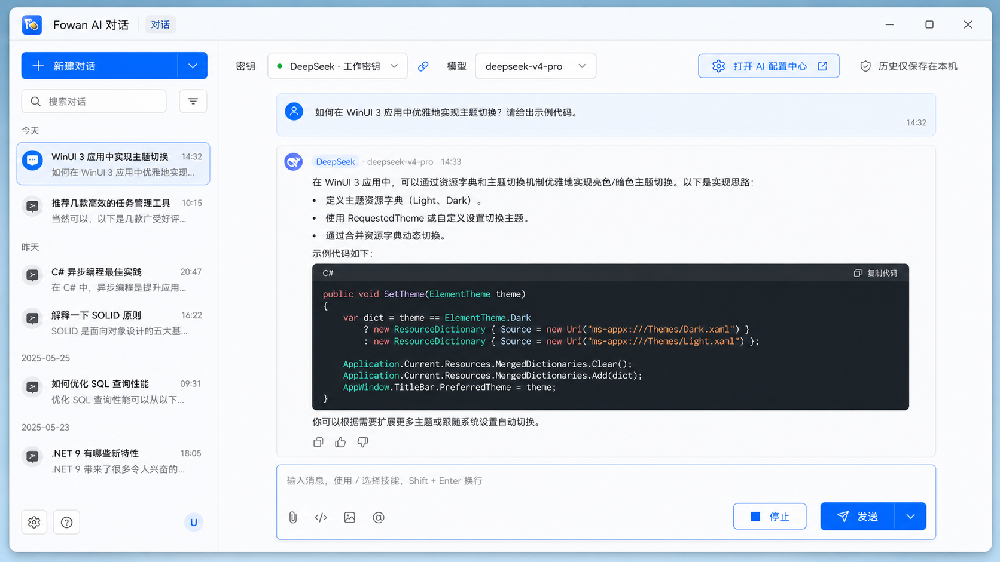

# Fowan Windows AI 对话工具需求文档

> 文档版本：0.1
> 日期：2026-07-13
> 状态：首版实现完成，作为后续开发与视觉验收基准
> 适用范围：独立 Windows 应用 `Fowan AI 对话`

## 1. 产品定位

当前产物为 `apps/windows/ai/chat/Fowan.Ai.Chat.Windows.csproj`，构建输出为 `out/windows-ai-chat/<configuration>/Fowan.Ai.Chat.Windows.exe`，发布目录为 `Tools/AI/Chat`。

`Fowan AI 对话` 是从 Fowan Toolbox 启动的独立 Windows 应用，专门承载多轮文本对话、流式生成和本地加密历史。它不是 Toolbox 内嵌页面，也不负责渠道、密钥、模型目录或工具默认模型的管理。

AI 管理由另一独立应用 `Fowan AI 配置中心` 负责。两个应用共享同一个 `fowan-core.exe`、协议、密钥安全存储和 AI 数据库，但保持独立进程、独立窗口、独立启动入口和独立 capability 检查。

## 2. 视觉与交互基准

以下概念图是 AI 对话工具后续开发的标准视觉基准：

实现必须保持概念图中的核心信息架构、视觉层级和交互位置：

- 独立 Windows 11 Fluent 窗口，标题为“Fowan AI 对话”。
- 左侧为可收起的会话导航，中间为占据主要空间的对话工作区。
- 顶部显示联动的密钥和模型选择器，以及“打开 AI 配置中心”入口。
- 主区域依次包含消息时间线和底部输入区，不长期展示配置表单或配置抽屉。
- 使用 Fowan 统一的浅色表面、蓝色强调色、圆角、边框、阴影、字体和图标体系。

概念图约束视觉和布局；本文文字约束功能、安全、状态和异常行为。当二者冲突时，安全与功能文字要求优先。任何有意的视觉偏离必须先更新本文和对应概念图。

## 3. 应用入口与进程行为

- Toolbox 提供独立工具卡“AI 对话”，依赖 `ai.chat.v1` capability。
- 应用建议产物名为 `Fowan.Ai.Chat.Windows.exe`，不得继续以内嵌 `AiWindow` 作为最终产品形态。
- 应用采用当前 Windows 用户级单实例；重复启动时恢复、激活并置前已有窗口。
- 点击“打开 AI 配置中心”启动或激活 `Fowan AI 配置中心`，不得在对话窗口内复制一套配置页面。
- 配置中心完成配置后可启动或激活本应用；两个应用的互相启动必须复用已有实例。
- Core 缺失、协议不兼容或安全存储不可用时显示不可用页面，不允许客户端直连供应商或明文降级保存。

## 4. 信息架构

### 4.1 会话导航

- 新建对话。
- 按更新时间分组显示本地历史会话。
- 搜索会话标题。
- 选择、重命名和删除会话。
- 空状态、加载状态和读取失败状态。

### 4.2 顶部配置栏

- 密钥选择器显示渠道和配置名称，不显示完整密钥。
- 模型选择器只显示当前密钥下已启用的模型。
- 切换密钥后重新计算模型列表；原模型不属于新密钥时必须清空或切换为有效默认值。
- 显示“历史仅保存在本机”的隐私提示。
- 显示“打开 AI 配置中心”跨应用入口。

### 4.3 对话时间线

- 支持用户消息和助手消息。
- 支持 Markdown、列表、引用、行内代码和代码块。
- 代码块提供复制操作。
- 助手消息显示实际渠道、密钥显示名和模型快照。
- 重新生成产生助手消息变体，可查看旧变体，默认展示最新变体。
- `cancelled`、`failed` 和流式生成中状态必须可辨识。

### 4.4 输入区

- 首版只支持文本输入和文本输出。
- 提供发送、停止生成和重新生成。
- 生成中发送按钮状态、停止按钮状态和输入可编辑策略必须一致。
- 不展示附件、图片、语音、联网搜索或工具调用入口。

## 5. 对话行为

- 新建对话优先应用 `ai.chat` 的默认绑定；没有有效绑定时要求用户选择密钥和模型。
- 会话中临时切换密钥或模型后继续使用当前活动分支的完整上下文。
- 每次请求使用发送瞬间的密钥和模型，并保存不含密钥正文的配置快照。
- 首条用户消息在本地截取生成标题，不额外调用模型。
- `ai.chat.send` 立即返回调用 ID，正文通过流式通知按顺序展示。
- 主动停止必须终止 HTTP 请求，并把已收到内容保存为 `cancelled` 消息。
- 错误重试复用原用户消息，不得重复创建用户记录。
- 重新生成基于同一用户消息创建新的助手变体。
- 首版发送当前活动分支完整上下文，不做自动摘要或静默裁剪。
- 超出上下文限制时明确提示用户新建对话。
- 删除密钥或模型不删除历史；再次发送前要求选择有效配置。

## 6. 云端传输确认

- 首次向每个渠道或自定义端点发送用户内容前显示明确、可取消的确认。
- 确认内容说明数据将发送到哪个服务和端点。
- 确认结果按规范化端点保存；端点变化后必须重新确认。
- 未确认时不得发送标题、消息、上下文或测试之外的任何用户内容。

## 7. Core 与协议边界

公开客户端只负责窗口、视图状态、本地化、安全错误摘要和 JSON-RPC 客户端。以下能力必须由私有 FowanCore 实现：

- 密钥读取与供应商认证。
- 渠道适配和模型调用。
- 上下文编排、流式处理、取消和错误归一化。
- DPAPI 加解密、对话持久化和消息变体关系。
- 云端传输确认状态。

本应用使用 `protocol/ai/v0.1` 中的会话与聊天接口，不得依赖私有 Rust crate、数据库表或 Credential Manager 内部引用。

## 8. 安全与隐私

- API 密钥不得进入客户端内存、日志、诊断包、崩溃信息或 JSON-RPC 响应。
- 对话标题和正文不得以明文写入文件或日志。
- UI 只显示安全错误摘要、HTTP 状态分类和可用的服务端请求 ID。
- 不展示可能包含用户内容的服务端原始错误正文。
- 历史只属于当前 Windows 用户和当前设备，不同步、不导出。

## 9. 错误与状态

UI 必须本地化处理 `protocol_mismatch`、`secret_store_unavailable`、`provider_auth_failed`、`provider_model_not_found`、`provider_rate_limited`、`provider_content_rejected`、`provider_unavailable`、`context_limit_exceeded`、`timeout` 和 `cancelled`。

错误状态不能清空已展示的历史或流式部分内容；恢复有效配置后用户可以继续当前会话。

## 10. 验收标准

- Toolbox 能启动独立 AI 对话进程，重复启动只激活已有实例。
- 对话应用能启动或激活独立 AI 配置中心，且自身不内嵌配置管理页面。
- 选择密钥后只能选择该密钥下的启用模型。
- 默认绑定、新建对话、会话内覆盖和配置删除后的失效处理正确。
- 流式内容顺序正确，中途取消后部分内容和状态可在重启后恢复。
- 重新生成创建助手变体，不重复用户消息。
- Markdown 和代码复制可用，助手消息显示实际渠道和模型。
- 数据库和日志扫描看不到密钥、标题或聊天正文。
- Core 不可用时不发生客户端直连或明文降级。
- Debug、Release、测试与打包保持零警告、零错误。

## 11. 首版范围外

- 图片、文件、语音和多模态。
- 联网搜索、工具调用、RAG 和插件执行。
- 自动模型路由、密钥轮询和故障切换。
- 云同步、历史导入导出和跨设备恢复。

## 12. 关联文档

- [AI 配置中心需求文档](windows_ai_config_center_requirements.md)
- [AI 协议 0.1](../protocol/ai/v0.1/README.md)
- [仓库边界](repository_boundaries.md)
