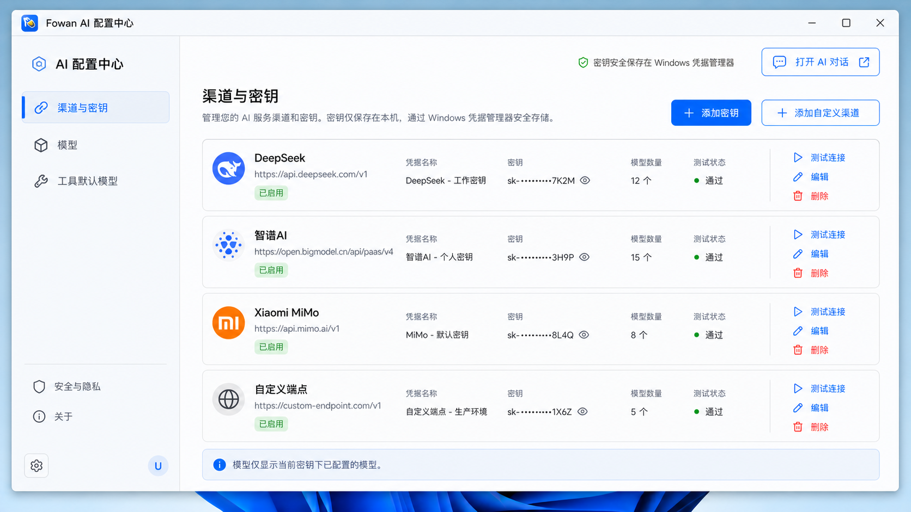

# Fowan Windows AI 配置中心需求文档

> 文档版本：0.1
> 日期：2026-07-13
> 状态：首版实现完成，作为后续开发与视觉验收基准
> 适用范围：独立 Windows 应用 `Fowan AI 配置中心`

## 1. 产品定位

当前产物为 `apps/windows/ai/config/Fowan.Ai.Config.Windows.csproj`，构建输出为 `out/windows-ai-config/<configuration>/Fowan.Ai.Config.Windows.exe`，发布目录为 `Tools/AI/Config`。

`Fowan AI 配置中心` 是从 Fowan Toolbox 启动的独立 Windows 管理应用，负责渠道、密钥、模型和工具 AI 默认模型配置。它不属于 Toolbox 全局设置，也不承载对话历史、消息时间线或聊天输入。

AI 对话由另一独立应用 `Fowan AI 对话` 负责。两个应用共享同一个 `fowan-core.exe`、协议、安全存储和配置数据库，但保持独立进程、独立窗口和独立启动入口。

## 2. 视觉与交互基准

以下概念图是 AI 配置中心后续开发的标准视觉基准：

实现必须保持概念图中的核心信息架构、视觉层级和交互位置：

- 独立 Windows 11 Fluent 窗口，标题为“Fowan AI 配置中心”。
- 左侧为配置中心导航，不得复用对话历史侧栏。
- 一级导航包含“渠道与密钥”“模型”“工具默认模型”。
- 右侧为全宽管理区域，使用清晰的列表、卡片、状态和操作层级。
- 顶部提供“打开 AI 对话”跨应用入口。
- 使用与 AI 对话应用一致的 Fowan 配色、字体、图标、圆角、边框和阴影。

概念图约束视觉和布局；本文文字约束功能、安全、状态和异常行为。当二者冲突时，安全与功能文字要求优先。任何有意的视觉偏离必须先更新本文和对应概念图。

## 3. 应用入口与进程行为

- Toolbox 提供独立工具卡“AI 配置中心”，依赖 `ai.config.v1` capability。
- 应用建议产物名为 `Fowan.Ai.Config.Windows.exe`。
- 应用采用当前 Windows 用户级单实例；重复启动时恢复、激活并置前已有窗口。
- 点击“打开 AI 对话”启动或激活 `Fowan AI 对话`，不得在配置中心内嵌聊天页面。
- AI 对话在没有有效配置时可以启动或激活本应用并定位到所需配置页。
- Core 缺失、协议不兼容或安全存储不可用时显示不可用页面，不允许明文降级保存。

## 4. 配置对象

### 4.1 渠道

`ChannelDefinition` 包含 ID、kind、显示名、默认 Base URL、是否内置和启用状态。

- 内置 DeepSeek、智谱AI 和 Xiaomi MiMo。
- 允许创建 OpenAI Chat Completions 兼容的自定义渠道。
- 内置渠道不可删除，可以启用或禁用；自定义渠道允许编辑和删除。
- 自定义端点默认要求 HTTPS，仅允许 `localhost` 和 `127.0.0.1` 使用 HTTP。
- URL 禁止包含用户信息。

### 4.2 密钥配置

`CredentialProfile` 包含 ID、channelId、配置名称、可选 Base URL 覆盖、安全存储引用、掩码提示、状态和最近测试结果。

- 同一渠道允许保存多个密钥。
- 写入时可以接收一次性 `secret`，任何响应和界面不得返回完整密钥。
- 列表只显示配置名称、渠道、掩码、端点、状态和测试结果。
- 编辑时留空 secret 表示保留原密钥；输入新 secret 表示替换。

### 4.3 模型配置

`ModelProfile` 必须属于一个具体密钥配置，包含模型 ID、显示名、preset/custom 来源、启用状态和最近测试结果。

- 选择密钥后只显示该密钥下的模型。
- 支持从应用预置模型添加，也支持手工填写模型 ID。
- 预置模型随应用版本更新，不得覆盖用户自定义模型。
- 删除密钥前必须处理其模型引用；不得静默级联删除历史或默认绑定。

### 4.4 工具默认模型

`ToolModelBinding` 为一个 `ToolAiFeature` 设置默认 credentialId 和 modelProfileId。

- 首版至少注册 `ai.chat`。
- 默认模型选择器必须受默认密钥联动约束。
- 删除被默认绑定引用的密钥或模型时返回冲突。
- 保存后新建 AI 对话使用新绑定，已有会话的历史快照保持不变。

## 5. 信息架构

### 5.1 渠道与密钥

- 展示渠道名称、端点、启用状态和密钥配置数量。
- 展示密钥配置名称、掩码、模型数量和最近测试状态。
- 提供添加密钥、添加自定义渠道、编辑、测试连接和删除。
- 多个密钥属于同一渠道时保持清晰分组。
- 任何列表、提示或可访问名称都不得包含完整密钥。

### 5.2 模型

- 首先选择密钥配置，再展示归属于该密钥的模型。
- 展示模型 ID、显示名、来源、启用状态和最近测试结果。
- 提供从预置添加、手工添加、编辑、测试和删除。
- 没有模型时显示明确空状态和“添加模型”主操作。

### 5.3 工具默认模型

- 展示所有已注册 `ToolAiFeature`。
- 每项功能提供联动的默认密钥和默认模型选择器。
- 缺少有效配置时显示解决路径，不自动选择其他渠道。
- 首版突出 `ai.chat`，后续 Todo、日记或工作流 AI 功能通过协议注册后进入此页。

## 6. 测试连接

- 测试连接只能由用户主动触发。
- 使用固定、合成、最小请求，不发送对话历史或其他用户内容。
- 30 秒超时，不自动重试，响应正文立即丢弃。
- UI 只显示成功、认证失败、模型不存在、限流、不可用、超时等安全分类，以及可用的请求 ID。
- 不展示服务端原始响应正文。

## 7. Core 与协议边界

公开客户端只负责窗口、表单、验证提示、本地化、安全错误摘要和 JSON-RPC 客户端。以下能力必须由私有 FowanCore 实现：

- Windows Credential Manager 密钥写入、读取、替换和删除。
- 配置关系、引用冲突和模型归属策略。
- 渠道预置、端点校验、测试连接和错误归一化。
- SQLite 持久化以及任何敏感数据加解密。

本应用使用 `protocol/ai/v0.1` 中的 channels、credentials、models、toolFeatures 和 bindings 接口，不得依赖私有 Rust crate、数据库表或安全存储内部引用。

## 8. 安全要求

- API 密钥只保存在 Windows Credential Manager，不进入 `ai.db`。
- UI、日志、诊断包、JSON-RPC 响应、测试输出和崩溃信息不得出现完整密钥。
- 禁止把认证头转发到跨域重定向地址。
- 自定义端点禁止 URL 用户信息，并按 HTTPS/回环 HTTP 规则校验。
- 删除操作不得影响加密历史正文和历史消息上的渠道/模型快照。
- 安全存储不可用时配置中心必须停止密钥写入，不允许明文替代。

## 9. 删除与冲突

- 删除自定义渠道前检查密钥引用。
- 删除密钥前检查模型和默认绑定引用。
- 删除模型前检查默认绑定引用。
- 存在引用时返回 `conflict`，界面列出需要先处理的配置类型。
- 不自动级联删除，不因删除配置而删除对话历史。

## 10. 验收标准

- Toolbox 能启动独立配置中心进程，重复启动只激活已有实例。
- 配置中心能启动或激活独立 AI 对话应用，且自身不包含聊天历史或输入框。
- 同一渠道可以保存多个密钥，列表只显示名称和掩码。
- 选择密钥后只能看到并管理该密钥下的模型。
- `ai.chat` 默认绑定可以正确保存、读取、更新和删除。
- DeepSeek、智谱AI、MiMo 和自定义端点通过模拟服务完成测试连接及错误映射。
- 删除存在模型或绑定引用的配置时返回冲突，不发生级联删除。
- Credential Manager、数据库、日志和 JSON-RPC 泄漏扫描不包含完整密钥。
- Core 或安全存储不可用时没有明文降级。
- Debug、Release、测试与打包保持零警告、零错误。

## 11. 首版范围外

- 聊天消息、历史会话和流式生成界面。
- 自动模型路由、密钥轮询和自动故障切换。
- 密钥同步、导出、恢复和团队共享。
- 非 OpenAI Chat Completions 兼容的专用供应商协议。
- 自动连接测试和后台健康检查。

## 12. 关联文档

- [AI 对话工具需求文档](windows_ai_chat_requirements.md)
- [AI 协议 0.1](../protocol/ai/v0.1/README.md)
- [仓库边界](repository_boundaries.md)
