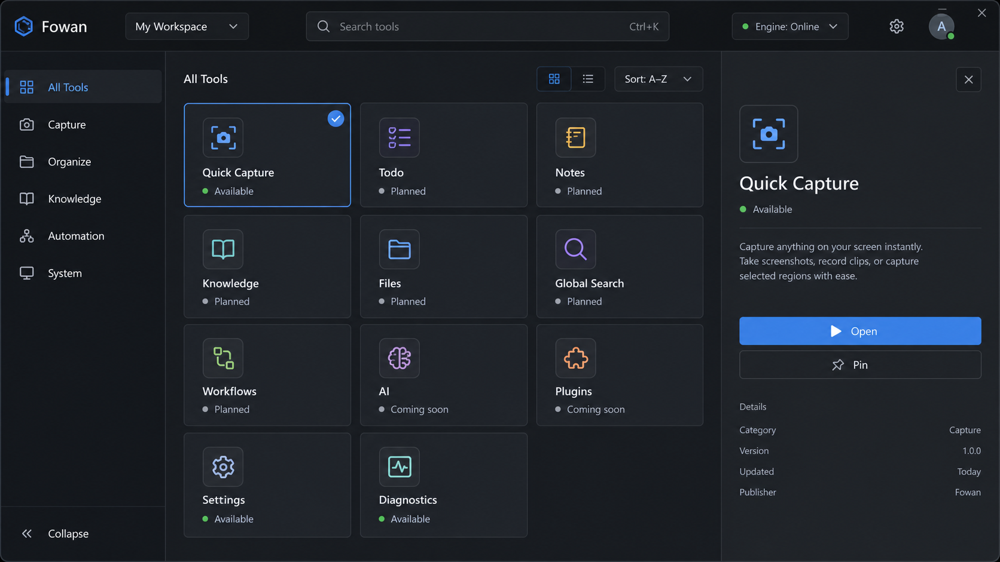
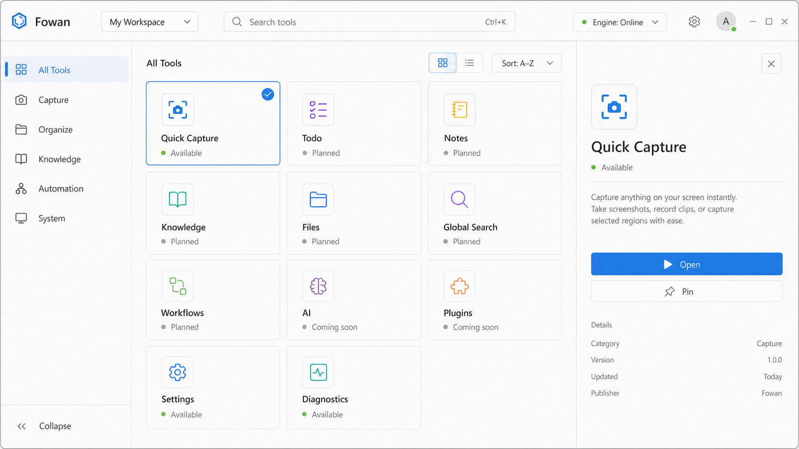
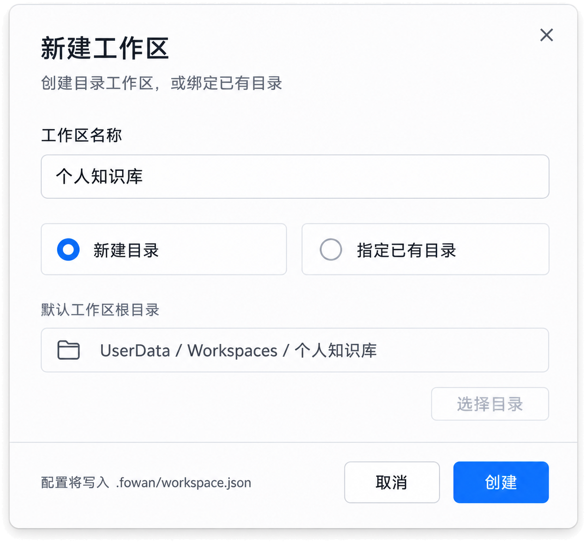

# Fowan Windows 客户端首版工具箱 UI 设计

> 文档版本：v0.4 Draft
> 日期：2026-07-01
> 适用范围：Windows Client 首版工具箱 UI / UX
> 客户端通用功能：`docs/client_common_function_design.md`
> 开闭源边界：`docs/repository_boundaries.md`

---

## 1. 设计定位

Windows 首版 UI 改为“现代工具箱 / Tool Launcher”风格。它不是 Todo 应用，也不是复杂 dashboard，而是一个原生、模块化、轻量科技感的工具入口。

首版目标：

- 让用户一打开 Fowan 就看到“这里是一组可逐步扩展的 AI 工作工具”。
- 用工具卡片表达可用能力、规划能力和核心状态。
- 保持现代感和科技感，但整体仍然是办公工具，不做营销 hero、不做重装饰。
- 首版只让少量基础工具可用，其他业务能力以 Coming Soon 工具卡占位。

首版可用：

- Toolbox Home。
- Settings。
- Diagnostics。

首版禁用：

- Quick Capture。

首版占位：

- Todo。
- Notes。
- Knowledge。
- Files。
- Global Search。
- Workflows。
- AI。
- Plugins。

Todo 后续作为工具箱中的一种工具出现，不再是首版主页面。

---

## 2. 设计原则

### 2.1 Toolbox First

- 首页是工具网格，不是任务列表。
- 左侧导航按工具类别组织，不按单一业务对象组织。
- 中间区域展示工具卡片。
- 右侧面板展示选中工具的简介、状态、依赖能力和快捷动作。
- Coming Soon 工具可以展示愿景，但不能进入误导性的完整流程。

### 2.2 现代科技感

关键词：

```text
Native
Toolbox
Modular
Focused
Modern
Technical
Calm
```

视觉方向：

- 克制的深浅色主题。
- 细边框、轻层级、清晰状态。
- 工具卡片用图标、短文案和状态标签建立识别。
- 小面积使用品牌色和状态色。
- 不使用大面积渐变、装饰性光斑、营销式标题区。

### 2.3 原生 Windows

- 使用 WinUI 3 / Windows App SDK 原生控件。
- 视觉贴近 Fluent / Windows 11。
- 支持键盘、鼠标、触控。
- 支持浅色、深色、系统主题、高对比度。
- 保持办公工具的信息密度和扫描效率。

---

## 3. Windows 独占平台体验

通用客户端能力见 `docs/client_common_function_design.md`。本节只承接 Windows 独占体验。

### 3.1 技术选型

```text
UI:
  - WinUI 3
  - Windows App SDK
  - C#
  - MVVM

Platform integration:
  - Win32 interop where WinUI / Windows App SDK does not cover enough
  - Windows notification activation
  - RegisterHotKey-style global shortcut adapter
  - Windows Credential Manager / Core secret service bridge
```

### 3.2 Windows 项目结构

```text
Fowan.sln

apps/windows/toolbox/
  Fowan.Windows.csproj
  App.xaml
  App.xaml.cs
  MainWindow.cs
  Models/
  Services/
  Resources/
    Strings/
  Assets/

assets/
  brand/
  design/windows/

scripts/
  build-windows.ps1
  run-windows.ps1

未来扩展：
  apps/windows/toolbox/
    Activation/
    Navigation/
    Views/
    ViewModels/
    CompositionRoot/
    Assets/

  Fowan.DesignSystem/
    Tokens/
    Styles/
    Controls/
    Icons/

  Fowan.Protocol.Client/
    Transport/
    JsonRpc/
    Methods/
    Events/
    Models/
    Compatibility/

  Fowan.Platform.Windows/
    EngineSupervisor/
    Tray/
    Hotkeys/
    Notifications/
    CredentialStore/
    Clipboard/
    FilePickers/
    UriActivation/
    Startup/
    JumpList/
    Windowing/
    Diagnostics/
```

### 3.3 Windows 系统入口

首版工具箱可启用：

- Tray。
- Open Toolbox 全局快捷键。
- Quick Capture 全局快捷键。
- Diagnostics / Engine 状态入口。
- Jump List：Toolbox、Quick Capture、Settings。

后续业务工具再启用：

- Explorer integration。
- Share / Send To。
- Global Search shortcut。
- Workflow notification。
- Plugin entry。

### 3.4 EngineSupervisor

Windows Client 负责以当前用户身份连接或拉起本机 Desktop Engine。

状态：

```text
NotInstalled
NotRunning
Starting
Connected
Degraded
Disconnected
VersionMismatch
Unauthorized
```

UI 要求：

- Starting 使用轻量状态提示。
- Disconnected 使用 InfoBar + Retry。
- VersionMismatch 使用阻塞更新提示。
- Degraded 显示哪些工具不可用。

### 3.5 Windows 安装与更新视角

首版 UI 展示：

- Client 版本。
- Core 版本。
- Protocol 版本。
- 更新可用。
- 修复 / 重试入口。

Packaging ADR 后续决定：

- MSIX。
- 传统安装器。
- packaged with external location。
- Microsoft Store 是否作为分发渠道。

---

## 4. 首版信息架构

```text
Fowan
  All Tools
  Capture
  Organize
  Knowledge
  Automation
  System

Bottom
  Settings
  Diagnostics
```

分类说明：

- `All Tools`：默认首页，展示全部工具卡。
- `Capture`：快速捕捉类工具。
- `Organize`：整理类工具，包括后续 Todo 和 Notes。
- `Knowledge`：知识、文件、搜索相关工具占位。
- `Automation`：工作流、AI、插件相关工具占位。
- `System`：设置、诊断、Engine 状态。

---

## 5. 主窗口布局

### 5.1 标准工具箱布局

```text
┌──────────────────────────────────────────────────────────────────────────┐
│ Fowan / Workspace     Search tools...       Engine status     Account    │
├───────────────┬──────────────────────────────────────┬───────────────────┤
│ Categories    │ Tool Grid                            │ Tool Detail       │
│               │                                      │                   │
│ All Tools     │ ┌ Quick Capture ┐ ┌ Todo        ┐   │ Quick Capture     │
│ Capture       │ │ Available     │ │ Planned     │   │ Available         │
│ Organize      │ └───────────────┘ └─────────────┘   │                 │
│ Knowledge     │ ┌ Notes         ┐ ┌ Knowledge   ┐   │ Capture text,     │
│ Automation    │ │ Planned       │ │ Planned     │   │ clipboard, and    │
│ System        │ └───────────────┘ └─────────────┘   │ simple ideas.     │
│               │                                      │                   │
│ Settings      │ ┌ Diagnostics   ┐ ┌ Workflows   ┐   │ [Open] [Pin]      │
│ Diagnostics   │ │ Available     │ │ Planned     │   │                   │
└───────────────┴──────────────────────────────────────┴───────────────────┘
```

### 5.2 示例图

以下两张图作为首版工具箱首页的视觉参考。实现时以布局、信息层级、工具卡状态、左右面板关系和整体气质为准，不要求逐像素复刻。

深色主题：



浅色主题：



新建工作区弹窗：



推荐尺寸：

```text
Window minimum:
  980 x 680

Category pane:
  Expanded: 220 px
  Compact: 56 px

Tool grid:
  Min: 480 px
  Card width: 220-280 px
  Card min height: 132 px

Tool detail pane:
  Width: 320-380 px
  Collapsible below 1180 px
```

### 5.3 窄窗口行为

```text
>= 1200 px:
  category pane + tool grid + detail pane

980-1199 px:
  category pane + tool grid, detail opens as slide-over pane

< 980 px:
  compact category pane, tool detail opens as full page
```

---

## 6. 工具卡片设计

### 6.1 ToolCard

每张工具卡包含：

```text
Icon
Tool name
One-line description
Status label
Optional capability hint
Primary action
```

状态：

```text
Available
Coming Soon
Disabled
Requires Engine
Requires Sign-in
```

交互：

- 单击选择工具，右侧详情面板更新。
- 双击或 Enter 执行主动作。
- Coming Soon 工具不可进入完整流程，主按钮显示 `Planned`。
- Disabled 工具显示原因，例如 Engine disconnected。

视觉：

- 卡片圆角不超过 8px。
- 使用细边框和轻 hover。
- 不使用卡片套卡片。
- 图标优先使用 Windows / Fluent 风格。
- 状态标签小面积展示，不抢标题。

### 6.2 ToolCategory

分类用于过滤工具卡，不代表业务模块已经实现。

```text
All Tools
Capture
Organize
Knowledge
Automation
System
```

### 6.3 Tool Detail Pane

详情面板展示：

```text
Tool name
Status
Short description
Available actions
Required capabilities
Recent activity
Documentation / planned note
```

可用工具显示主动作。

Coming Soon 工具显示：

- Planned。
- 简短说明。
- 未来依赖能力。
- 不提供会误导用户的进入按钮。

---

## 7. 首版工具清单

### 7.1 Available

```text
Toolbox Home
  - 回到工具箱首页。

Quick Capture
  - 轻量捕捉文本、剪贴板或简单想法。
  - 首版只保存为基础 capture 记录或进入占位流程，具体业务落点由后续工具决定。

Settings
  - 主题、语言、启动、基础偏好。

Diagnostics
  - Client / Core / Protocol 版本、Engine 状态、capability、日志入口。
```

### 7.2 Coming Soon

```text
Todo
  - 后续作为任务管理工具加入工具箱。

Notes
  - 后续作为笔记工具加入工具箱。

Knowledge
  - 后续作为知识整理工具加入工具箱。

Files
  - 后续作为文件索引和文件处理工具加入工具箱。

Global Search
  - 后续作为统一搜索工具加入工具箱。

Workflows
  - 后续作为自动化工作流工具加入工具箱。

AI
  - 后续作为 AI 助手或 AI 操作入口加入工具箱。

Plugins
  - 后续作为插件 / MCP / Skill 管理工具加入工具箱。
```

---

## 8. Quick Capture

Quick Capture 作为捕捉类工具卡保留，首版先禁用，不绑定 Todo。

入口：

- 工具卡。
- 顶部快捷按钮。
- Tray。
- 全局快捷键。

浮动窗口：

```text
┌──────────────────────────────┐
│ Quick Capture                │
│ [ write something...       ] │
│                              │
│ Destination: Capture buffer  │
│ [Capture] [Cancel]           │
└──────────────────────────────┘
```

行为：

- Enter / Ctrl+Enter 保存。
- Esc 关闭。
- 支持文本和剪贴板内容。
- 不提供 task/note/file/workflow 类型切换。
- 保存后的业务归类由后续工具实现。

---

## 9. Settings 与 Diagnostics

### 9.1 Settings

首版设置：

- Theme：system / light / dark。
- Language：system / zh-CN / en-US。
- Startup behavior。
- Quick Capture shortcut（首版禁用）。
- Privacy basics。
- About。

主题切换要求：

- 首版必须支持跟随系统、浅色、深色三种模式。
- 切换后工具箱首页、工具卡、详情面板、InfoBar、浮动 Quick Capture 都必须同步更新。
- 浅色和深色主题都使用同一套布局和信息密度。
- 禁止为深色主题单独加入装饰性背景、渐变或光斑。

中英文切换要求：

- 首版必须支持简体中文和英文。
- 默认使用 system language。
- 所有 UI 文案必须走资源文件或等价本地化机制，不允许在 View / ViewModel 中硬编码展示文本。
- 工具名、分类名、状态标签、按钮、错误信息、设置项、诊断字段都必须可本地化。
- 中英文切换后布局不能溢出；长文本使用截断、换行或 tooltip。

### 9.2 Diagnostics

首版诊断：

- Client version。
- Core version。
- Protocol version。
- Engine status。
- Capability list。
- Recent errors。
- Open log folder。
- Export diagnostics。

Diagnostics 是首版工具箱可信度的一部分，不能藏得太深。

---

## 10. 搜索

首版顶部搜索只搜索工具，不做业务内容搜索。

范围：

- 工具名。
- 工具描述。
- 工具分类。
- 状态。

不做：

- 文件搜索。
- 知识库搜索。
- Todo 搜索。
- AI assisted search。

全局搜索后续作为独立工具加入工具箱。

---

## 11. 托盘与通知

### 11.1 Tray 菜单

```text
Open Toolbox
Quick Capture
Diagnostics
Settings
Quit
```

不放：

- Todo。
- Search。
- Running Workflows。
- Plugins。
- Indexing。

### 11.2 Notifications

首版通知只覆盖工具箱和系统状态：

- Engine disconnected。
- Engine recovered。
- Update available。
- Quick Capture saved。

业务通知后续由各工具独立接入。

---

## 12. 视觉方向

### 12.1 风格

关键词：

```text
Native
Toolbox
Modular
Focused
Modern
Technical
```

避免：

- 营销式 hero。
- 大面积渐变。
- 装饰性光斑或背景球。
- 复杂 dashboard。
- 过多未来能力说明文字。
- 卡片套卡片。

### 12.2 色彩

建议：

- 基础使用 Windows / Fluent 语义色。
- Fowan 品牌色用于 active、focus、primary action。
- 工具分类只用小面积色条或图标色。
- 状态色遵循系统语义。

状态色：

```text
Available: accent / success
Coming Soon: neutral
Disabled: muted
Requires Engine: warning
Error: system error
```

### 12.3 字体与密度

- 使用 Segoe UI Variable。
- 工具名 15-16。
- 描述 12-13。
- 分类标题 12-13。
- 页面标题 24-28。
- 不使用 viewport-based 字号。
- Letter spacing 为 0。

### 12.4 动效

- Hover 轻微边框和背景变化。
- 选中工具时 detail pane 内容平滑替换。
- 不做炫技动效。
- 动效必须尊重系统 reduced motion。

---

## 13. 交互状态

### 13.1 Engine 状态

```text
Connected:
  顶部状态点，不打扰。

Starting:
  顶部状态显示 Starting engine...

Disconnected:
  InfoBar + Retry，依赖 Engine 的工具标为 Disabled。

VersionMismatch:
  Blocking dialog with update action。

Degraded:
  InfoBar 显示哪些工具不可用。
```

### 13.2 工具状态

```text
Available:
  主按钮可用。

Coming Soon:
  主按钮显示 Planned，不可执行。

Disabled:
  显示原因和恢复动作。

Requires Sign-in:
  显示 Sign in action。

Requires Engine:
  显示 Start / Retry Engine action。
```

### 13.3 空状态

示例：

```text
No tools in this category yet.
No recent activity.
Engine is starting.
```

### 13.4 错误态

错误展示：

- 用户可理解的信息。
- Retry。
- Details 折叠。
- Copy diagnostics。

---

## 14. 快捷键

建议：

```text
Ctrl+K:
  Focus tool search

Ctrl+Shift+C:
  Quick Capture

Ctrl+1..6:
  Switch tool category

Enter:
  Open selected available tool

Esc:
  Close detail pane or floating capture
```

全局快捷键：

```text
Open Toolbox
Quick Capture
```

---

## 15. 无障碍

要求：

- 全键盘可用。
- 工具卡可被屏幕阅读器读出名称、描述和状态。
- 图标按钮有 tooltip 和 accessible name。
- 颜色不是唯一状态表达。
- 支持高对比度。
- 支持系统字号缩放。
- Detail pane 焦点管理正确。
- Coming Soon / Disabled 状态不可误报为可执行。

---

## 16. 后续工具卡设计

以下能力不进入首版可用流程，后续作为工具卡逐步实现：

```text
Todo
Notes
Knowledge
Files / Indexing
Global Search
Workflows
AI
Plugins / MCP / Skill
Sync / Devices
```

接入原则：

- 每个能力先以工具卡进入工具箱。
- 工具成熟后再拥有独立工作区。
- 不把所有能力塞进首页。
- 不把 Coming Soon 工具做成可误操作页面。
- Todo 是工具箱中的一种工具，而不是默认壳层。

---

## 17. 首版 UI 交付物

建议后续产出：

```text
1. Toolbox shell wireframe
2. Tool grid mock
3. Tool detail pane mock
4. Quick Capture floating panel prototype
5. Settings / Diagnostics minimal mock
6. Available / Coming Soon / Disabled card states
7. Light / dark theme token draft
8. WinUI style token draft
9. zh-CN / en-US localization string draft
```

---

## 18. 与架构文档的关系

本 UI 文档约束：

- Windows 首版 UI 是工具箱。
- Windows 独占系统入口和平台体验。
- 工具卡片、分类、状态和工具详情面板。
- Quick Capture（禁用）、Settings、Diagnostics 的首版位置。

它不改变：

- 客户端通用功能设计。
- Windows Client 与 Core 的协议边界。
- 核心能力归属。
- 开源/闭源边界。
- 跨平台核心架构。
- 后续 Todo / Notes / Knowledge / Files / Search / Workflows / AI 的独立工具规划。

---

## 19. 参考资料

- [Fluent 2 Design System](https://fluent2.microsoft.design/)
- [NavigationView](https://learn.microsoft.com/en-us/windows/apps/develop/ui/controls/navigationview)
- [CommandBar](https://learn.microsoft.com/en-us/windows/apps/develop/ui/controls/command-bar)
- [WinUI 3](https://learn.microsoft.com/en-us/windows/apps/winui/winui3/)
- [Windows App SDK](https://learn.microsoft.com/en-us/windows/apps/windows-app-sdk/)
- [Windows app notifications](https://learn.microsoft.com/en-us/windows/apps/develop/notifications/app-notifications/)
- [Windows notification area](https://learn.microsoft.com/en-us/windows/win32/shell/notification-area)
- [RegisterHotKey](https://learn.microsoft.com/en-us/windows/win32/api/winuser/nf-winuser-registerhotkey)
- [Windows Credential Manager](https://learn.microsoft.com/en-us/windows/win32/secauthn/credential-manager)
