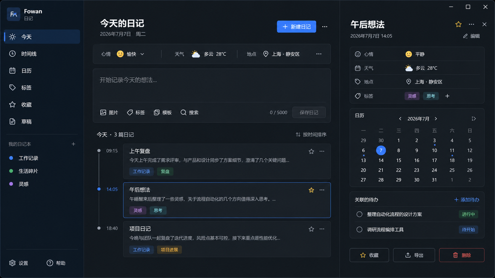
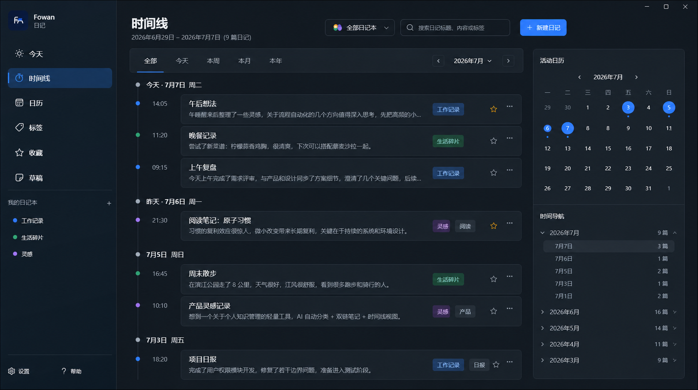
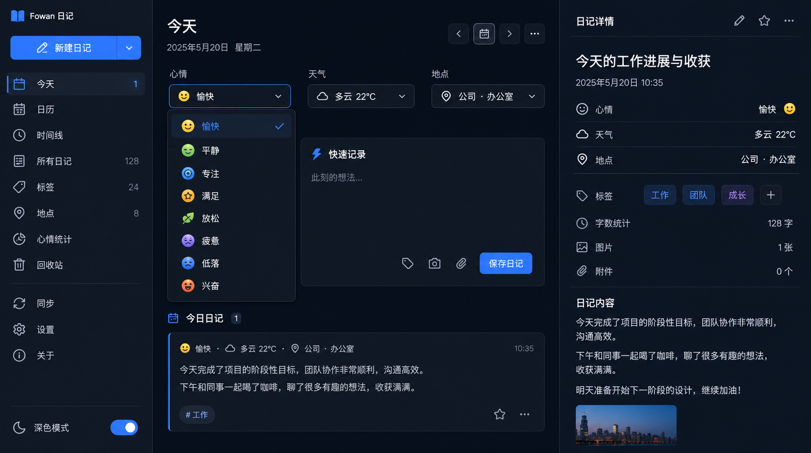
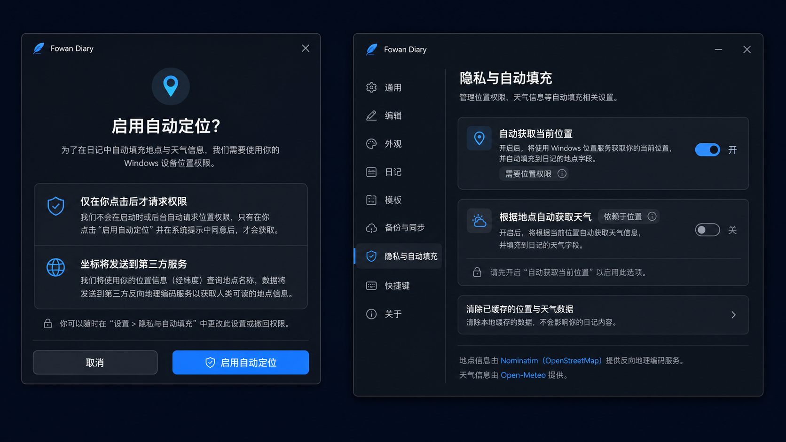

# Fowan Windows 日记需求文档

> 文档版本：0.3
> 日期：2026-07-10
> 适用范围：Fowan Windows 日记工具

---

## 1. 产品定位

Fowan 日记是聚合在 Fowan 工具箱内的独立 Windows 工具。它拥有独立进程、窗口、本地数据文件和构建入口；工具箱仅负责展示入口和启动工具。

日记工具用于快速记录、每日回顾、日记本整理和时间线浏览。它不承担待办、知识库、协作或跨工具全局搜索职责，但可以只读关联待办。

## 2. 视觉基准与概念图

非时间线页面以原始 v8 深色三栏布局为视觉基准：左栏 274、右栏 526，保持元信息条、快速记录卡、日记卡片和右侧详情的密度与分层。浅色主题复用同一信息架构。

时间线是独立的沉浸式浏览页：左侧导航保持一致，右侧改为活动日历和时间导航，不展示日记详情、待办或快速记录。

主页面元信息保持原有三段条尺寸，但每一项都是独立下拉交互，而不是共用“记录信息”弹层。

定位与自动天气必须先得到用户手动确认；概念图展示首次确认和设置中的双开关关系。

## 3. 信息架构

- 左侧导航：今天、时间线、日历、标签、收藏、草稿、日记本、设置和帮助。
- 今天、日历、收藏、草稿、日记本：保持 v8 三栏布局。
- 中间工作区：标题、三段元信息条、单正文快速记录卡、工具栏和日记列表。
- 右侧详情：元信息、日历、关联待办、图片、导出、编辑和删除。
- 时间线：独立全宽记录流、范围筛选、日记本切换、活动日历和日期锚点。
- 标签：专门的标签管理页，维护标签表、使用次数、颜色、筛选与新建入口。

## 4. 日记与日记本

- “新建日记”立即创建本地草稿并聚焦快速记录区；正文首次非空行推导标题，保存后转为正式日记。
- 日记可收藏、编辑、删除、导出 Markdown、关联待办和添加本地图片附件。
- 附件复制到 %LOCALAPPDATA%\Fowan\Diary\attachments\<entryId>；删除日记时一并清理。
- 日记本支持新建、重命名和删除；删除时必须迁移日记。时间线当前选中的已删日记本自动回退到“全部日记本”。
- 待办关联是日记侧只读快照，不修改待办数据。

## 5. 主页面元信息

主页面的心情、天气、地点保留在同一条三段式元信息条中，但每项独立打开自己的下拉内容：

| 项目 | 交互 | 选项/结果 |
| --- | --- | --- |
| 心情 | 单独下拉选择 | 愉快、平静、专注、满足、放松、疲惫、低落、兴奋 |
| 天气 | 单独下拉选择或主动自动获取 | 晴、多云、阴、小雨、中雨、大雨、冻雨、雷雨、雪、雾、待补充；自动结果附带四舍五入后的摄氏温度 |
| 地点 | 可编辑输入、最近地点下拉、主动获取当前位置 | 手动地点为普通文本；自动地点保存地点名称和坐标来源 |

- 手动修改地点会清除该条目的自动定位详情；手动修改天气会清除自动天气详情。
- 自动功能绝不在后台、启动时或定时执行；仅在用户点击具体操作时请求位置或网络。
- 完整编辑弹层用于标题、正文和日记本；元信息和标签不再通过统一文本弹层修改。

## 6. 标签管理

### 6.1 标签表

标签导航页是标签的专门管理界面：

- 显示标签名称、颜色圆点、日记使用次数、编辑和删除入口。
- 可新建标签、重命名、选择颜色和删除标签定义。
- 标签名大小写不敏感且唯一；重命名同步更新所有关联日记的文本标签。
- 删除标签定义不删除历史日记中的标签文字。这些历史文本保持可见；重新建立同名标签后可再次纳入管理和筛选。
- 快速记录工具栏、详情区和日记卡片通过“选择标签”界面多选既有标签，并可在同一处新建标签。
- 标签页顶部保留“全部”与标签色块筛选，可筛选当前标签的日记。

### 6.2 第一版 12 色

| 标识 | 色值 | 标识 | 色值 |
| --- | --- | --- | --- |
| 蓝 | #2F80FF | 天蓝 | #38BDF8 |
| 青 | #14B8A6 | 绿 | #35B779 |
| 青柠 | #84CC16 | 黄 | #EAB308 |
| 橙 | #F59E0B | 红 | #E5484D |
| 玫红 | #F43F5E | 粉 | #EC4899 |
| 紫 | #9D6DF2 | 石板灰 | #64748B |

深浅主题使用同一标签色标；标签底色为低透明度同色层，文字为同色系高对比前景，不能退回统一白色文字。

## 7. 定位、第三方传输与自动天气

### 7.1 默认与授权

- “自动获取当前位置”和“根据地点自动获取天气”默认均关闭。
- 第一次开启或第一次点击自动功能时，应用内先展示可取消的确认提示；用户明确同意后才请求 Windows 定位权限。
- 定位确认明确说明：仅在主动点击时读取本次坐标，并将坐标发送给 Nominatim 解析为可读地点名称。
- 天气确认独立说明：仅在主动点击“自动获取当前位置天气”时，将本次坐标发送给 Open-Meteo 查询当前天气。
- Windows 系统权限拒绝、应用内确认取消、网络失败均不能覆盖用户原有地点或天气。
- 用户可在设置中随时关闭任一功能。关闭定位会同时关闭自动天气；关闭不撤销 Windows 系统权限，也不删除已经写入日记的历史元数据。

### 7.2 服务与最小化数据

- 设备坐标：使用 Windows Geolocator，定位请求始终发生在前台用户操作中。
- 反向地理编码：默认 HTTPS 端点为 Nominatim /reverse，发送经纬度和中文语言偏好；网络请求使用 Fowan-Diary/1.0 User-Agent。
- 当前天气：默认 HTTPS 端点为 Open-Meteo /v1/forecast，仅请求 temperature_2m 和 weather_code。
- 坐标在当前会话仅短时复用（最多 5 分钟），避免用户连续点击时重复请求设备定位；不后台上报。
- 自动天气映射 WMO 天气码为本节的固定中文天气项，日记保存来源、原始温度、天气码、坐标和获取时间。
- 两个第三方端点均写入本地设置且限定为 HTTPS，方便在发布策略或服务条款变化时替换。Nominatim 使用须遵守其公共服务使用政策；Open-Meteo 免费端点仅适用于其条款许可的场景，商业发行应配置已授权服务。

## 8. 时间线

- 默认“全部日记本”，顶部下拉可切换具体日记本，选择跨重启保存。
- 全部模式交错展示各日记本；单本模式不重复显示日记本标识。
- 记录使用 CreatedAt → UpdatedAt → Id 的稳定倒序；跨日期显示日期节点，同日后续记录只显示时间。
- 快捷范围支持全部、今天、本周、本月、本年；前后按钮按当前范围移动。范围、活动月和日期筛选仅保留在当前会话。
- 右侧活动日历标出有记录日期；点击日期按日筛选，点击日期/月锚点清除筛选并滚动到时间轴位置。
- 卡片点击进入既有编辑弹层；搜索选择结果定位到时间轴条目。

## 9. 本地数据与兼容性

- 数据目录：%LOCALAPPDATA%\Fowan\Diary，可通过 FOWAN_DIARY_DATA_ROOT 注入测试根目录。
- DiaryData.SchemaVersion 为 3，新增 tagCatalog；旧日记的字符串标签在读取时自动生成蓝色默认标签定义。
- DiaryEntry 保留原有 tags 字符串数组，兼容搜索、导出和旧数据；新增可空 locationDetails 与 weatherDetails。
- DiarySettings 新增定位/天气开关、两项同意时间和 HTTPS 服务端点。旧设置加载后功能关闭、端点补默认值。
- 不改变日记本、附件、待办关联与时间线查询公共兼容接口。

## 10. 验收与测试

- Shared 测试覆盖旧数据迁移、标签唯一性/重命名/删除、12 色目录、设置默认关闭和依赖关系。
- 使用可注入 HTTP 客户端测试 Open-Meteo 响应、WMO 映射和失败不覆写数据；不得在测试中调用真实第三方网络。
- UI 验收覆盖独立心情/天气/地点下拉、手动地点、定位同意/拒绝、天气同意/拒绝、设置双开关、标签新建/改色/筛选/删除。
- 截图使用固定数据根目录，不污染本地日记库；对比主页面 v8 三栏边界与新增局部组件概念图。
- 停止运行中的 Diary 进程后，运行 Shared 测试、日记构建、完整解决方案构建和启动截图验证；完成标准为 0 警告、0 错误。

## 11. 范围边界

- 不并入 `apps/windows/toolbox` 工具箱主进程，不把日记做成待办子功能。
- 不增加云同步、协作、后台位置追踪、定时天气刷新或跨工具全文搜索。
- 不将用户坐标用于广告、分析或非本次地点/天气请求。
- 不在首版接入地图展示、路线或商业天气付费订阅。
