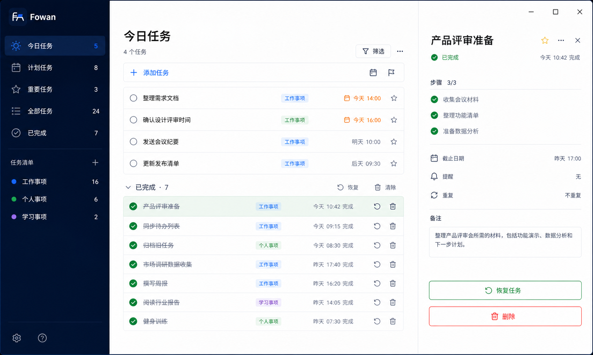
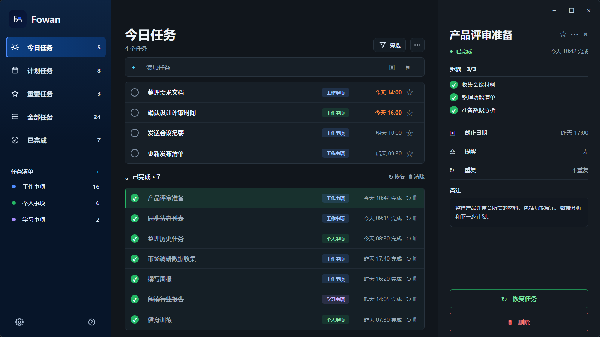
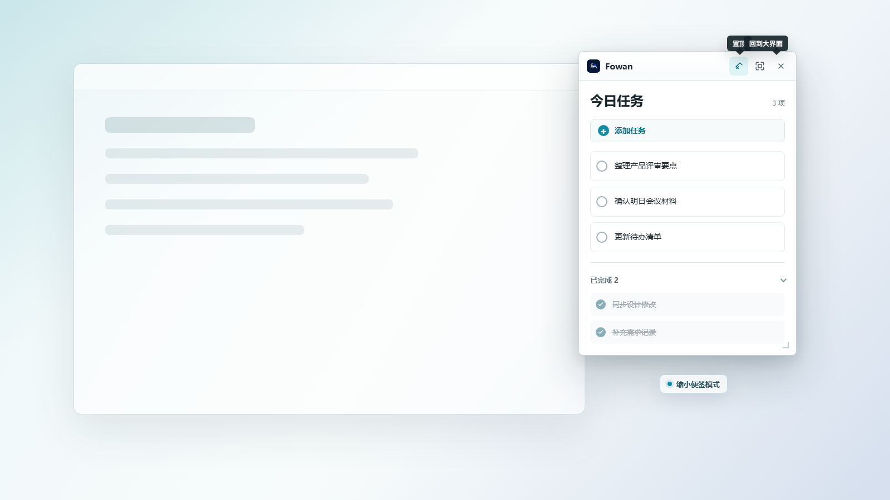
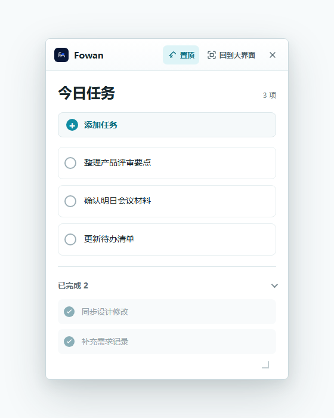

# Fowan Windows 待办 UI 设计文档

> 需求基准：`docs/windows_todo_requirements.md`

> 文档版本：v0.1 Draft
> 日期：2026-07-03
> 适用范围：Fowan Windows 待办客户端 UI / UX
> 浅色主题概念图：`assets/design/windows/fowan-todo-windows-completed-concept.png`
> 深色主题概念图：`assets/design/windows/fowan-todo-windows-dark-concept.png`
> 桌面便签模式：`assets/design/windows/fowan-todo-desktop-sticky-concept.png`
> 桌面便签纯 UI 参考图：`assets/design/windows/fowan-todo-sticky-mode-ui-reference.png`
> 品牌资源：`assets/brand/`

---

## 1. 设计定位

Fowan Windows 待办是独立的 Windows 待办工具，不是工具箱主界面的卡片详情页。工具箱可以把待办作为入口打开，但待办工具必须保持独立进程、独立窗口、独立数据文件和独立构建入口。

待办工具只承载任务管理能力。所有 UI 都围绕任务是否要做、什么时候做、是否重要、属于哪个清单、是否已经完成展开，不扩展到邮箱、购物、专注、统计、协作或日历套件。

核心目标：

- 打开应用后，用户能立即看到今天要处理的任务。
- 左侧导航只提供待办视图和用户清单，不引入其他产品概念。
- 中间列表是主要工作区，支持快速添加、勾选完成、查看完成记录。
- 右侧详情面板只展示任务详情和任务操作。
- `已完成` 是唯一任务终态入口，不再设计 `归档`。

---

## 2. 概念图

下图是当前 Windows 待办客户端浅色主题的视觉和布局参考。实现时以信息架构、区域关系、完成态表达和整体气质为准，不要求逐像素复刻。



### 2.1 深色主题概念图

深色主题沿用浅色主题的信息架构和交互层级，只调整背景、面板、分割线、文字和状态色的对比关系。深色主题不新增任何功能入口。



### 2.2 桌面便签模式概念图

下图是主窗口缩小后显示在桌面上的便签模式。它用于让用户在其他窗口前快速查看、勾选和新增今日任务，并通过顶部按钮保持置顶或切回完整窗口。



制作便签模式时，优先参考下面这张纯 UI 图。它去除了桌面背景和场景说明，只保留便签窗口本体、顶部操作、任务列表和已完成分组。



---

## 3. 范围边界

### 3.1 包含

- 今日任务、计划任务、重要任务、全部任务、已完成任务。
- 用户自建任务清单。
- 快速添加任务和任务详情编辑。
- 子任务、树状层级、展开和折叠。
- 开始时间、可选截止日期、重要标记和备注。
- 桌面便签模式。
- 恢复已完成任务和删除任务。

### 3.2 不包含

- 收件箱或邮箱入口。
- 购物清单专属入口。
- 归档入口。
- 专注时长、番茄钟或时间追踪。
- 数据分析看板。
- 团队协作、评论或聊天。
- 文件、知识库、日历套件等外部产品能力。
- 移动端或平板端 UI。

---

## 4. 信息架构

```text
Fowan Todo

任务视图
  今日任务
  计划任务
  重要任务
  全部任务
  已完成

任务清单
  默认清单
  用户自建清单

底部
  设置
  帮助
```

说明：

- `今日任务` 是默认首页。
- `计划任务` 只表示带有未来日期或提醒的任务，不引入完整日历视图。
- `重要任务` 聚合被标星的任务。
- `全部任务` 聚合所有未删除任务。
- `已完成` 是任务完成后的唯一聚合视图。
- `任务清单` 是用户自建分类，不预设购物、邮箱、协作等非待办概念。

---

## 5. 主窗口布局

### 5.1 三栏结构

```text
┌────────────────────────────────────────────────────────────────────────────┐
│ Fowan Todo                                             Window controls      │
├──────────────────┬─────────────────────────────────────┬───────────────────┤
│ Navigation       │ Task list                           │ Task detail       │
│                  │                                     │                   │
│ 今日任务          │ 今日任务                              │ 产品评审准备        │
│ 计划任务          │ 添加任务                              │ 已完成             │
│ 重要任务          │                                     │ 日期 / 备注        │
│ 全部任务          │ 未完成任务                            │ 子任务             │
│ 已完成            │ 已完成 · 7                            │ 恢复 / 删除        │
│                  │                                     │                   │
│ 任务清单          │                                     │                   │
└──────────────────┴─────────────────────────────────────┴───────────────────┘
```

### 5.2 尺寸建议

```text
Window minimum:
  1120 x 720

Left navigation:
  Expanded: 220-260 px
  Compact: 56 px

Task list:
  Min: 520 px
  Preferred: 640-760 px

Task detail:
  Width: 320-400 px
  Collapsible below 1180 px
```

### 5.3 响应行为

```text
>= 1180 px:
  左侧导航 + 任务列表 + 右侧详情面板

960-1179 px:
  左侧导航 + 任务列表，详情以 slide-over 面板打开

< 960 px:
  左侧导航进入 compact 模式，详情作为独立页面打开
```

### 5.4 桌面便签模式

桌面便签模式是主待办窗口的紧凑桌面形态，不是新的任务模块。它复用同一份任务数据、完成状态、折叠状态和排序规则。

```text
Sticky note:
  Width: 360-420 px
  Height: 480-560 px
  Position: last user position, default top-right

Header:
  Fowan icon + Fowan
  Pin button
  Expand button
  Close button

Content:
  Current task view title
  Add task
  Active tasks
  Completed section
```

行为规则：

- `置顶` 是开关状态，开启后便签窗口保持在其他窗口上方。
- `回到大界面` 将便签还原为完整待办窗口，并保留当前视图和选中任务。
- 便签模式可以新增、完成、恢复、展开和折叠任务。
- 便签模式不展示右侧详情面板。
- `已完成 N` 在便签中以紧凑分组显示，用户可以折叠或展开。
- 如果上次退出时处于便签模式，再次启动待办时应直接进入便签 shell，不先显示主窗口。
- 主窗口和便签模式互切应复用隐藏实例，避免首次切换承担明显冷启动；退出可见模式时必须清理隐藏协调进程，不能留下不可见后台孤儿。

---

## 6. 左侧导航

左侧导航用于切换任务视图和任务清单。它不承担工具箱、邮箱、日历、统计中心等额外职责。

### 6.1 顶部品牌区

顶部品牌区包含：

- Fowan 应用图标。
- `Fowan` 英文字母标识。

使用资源：

```text
assets/brand/windows/fowan-todo-app-icon-256.png
assets/brand/png/logo/color/fowan-logo-horizontal-color-512.png
```

### 6.2 任务视图

固定视图：

```text
今日任务
计划任务
重要任务
全部任务
已完成
```

每个视图可以显示任务数量。数量表示该视图下当前可见任务数，不作为分析指标。

### 6.3 任务清单

任务清单用于用户自定义分类，支持新建、重命名、删除、颜色标识和任务数量。

不预设 `购物` 这类场景化清单。用户可以自行创建，但产品默认信息架构不突出它。

---

## 7. 任务列表

任务列表是主要工作区，优先保证扫描效率和直接操作效率。

### 7.1 顶部区域

包含：

- 当前视图标题，例如 `今日任务`。
- 当前任务数量。
- 筛选按钮。
- 更多操作按钮。

筛选只覆盖待办相关字段：

- 是否重要。
- 开始时间和截止日期。
- 所属清单。
- 完成状态。

### 7.2 快速添加

快速添加栏显示为：

```text
+ 添加任务...
```

输入后按 Enter 新建任务。默认开始时间为当天，默认没有截止日期。

### 7.3 未完成任务行

每个未完成任务行包含：

- 完成勾选圆圈。
- 任务标题。
- 重要标记。
- 开始时间和截止日期摘要。
- 清单标签。
- 子任务展开入口和子任务进度。

任务层级最多三层，每个任务最多 100 个直接子任务。树状任务使用缩进表达层级，不能用独立看板或泳道替代。

---

## 8. 已完成任务设计

### 8.1 列表内完成分组

未完成任务下方显示 `已完成 N` 分组。默认可以折叠，展开后显示已完成任务。`今日任务` 视图中的已完成分组只显示当天完成的任务，历史已完成任务不再出现在今日任务中。

### 8.2 已完成任务行

已完成任务使用弱化文字、删除线和完成图标表达状态。完成状态不能只依赖颜色。

行内保留：

- 恢复任务。
- 删除任务。
- 查看任务详情。

### 8.3 独立已完成视图

左侧 `已完成` 视图聚合所有已完成任务。它是查看完成记录的入口，不是归档系统。

---

## 9. 任务详情面板

详情面板只展示当前任务字段和任务操作。

字段：

- 标题。
- 完成状态。
- 重要标记。
- 所属清单。
- 开始时间。
- 截止日期。
- 备注。
- 子任务。

操作：

- 保存编辑。
- 恢复任务。
- 删除任务。

空状态显示简短提示，不能展示产品营销文案或范围外功能。

---

## 10. 视觉规范

### 10.1 品牌色

待办界面应沿用 Fowan 品牌资产和 Windows 原生控件气质。强调色只用于当前选中、重要标记、主操作和焦点状态，不能让整个界面变成单一高饱和色块。

### 10.2 字体

默认使用 Windows 系统字体栈。正文和任务行保持办公工具密度，不使用 hero 级大字号。

### 10.3 形状和密度

- 卡片和面板圆角保持克制。
- 任务行高度稳定，hover、选中、勾选和展开状态不能造成布局跳动。
- 图标按钮必须有 tooltip 或可访问名称。

---

## 11. 交互状态

### 11.1 勾选完成

勾选任务后，任务进入已完成状态并移动到已完成分组或已完成视图。带有未完成子任务的父任务必须先弹窗确认，用户取消时不能修改任何任务状态。

### 11.2 恢复任务

恢复任务后，任务回到原清单和对应视图。恢复操作应保持子任务关系。

### 11.3 删除任务

删除是破坏性操作，需要明显的危险态样式。删除后任务不再出现在普通视图中。

### 11.4 任务拖动

主窗口和便签模式下长按任务后都可拖动排序或调整父子关系。拖动时必须显示虚线预览框，预览框的位置和缩进要表达松手后的归属。非法落点不能修改数据。
仅调整同一父级内排序时，任务及其子任务保持原清单不变；只有拖动造成父子关系变化时，才按新的父任务归属同步整棵子树的清单。

---

## 12. 快捷键

```text
Ctrl+N:
  新建任务

Ctrl+F:
  聚焦筛选或搜索

Enter:
  在输入框中提交新任务

Space:
  切换选中任务完成状态

Delete:
  删除选中任务

Esc:
  关闭详情面板或取消编辑
```

---

## 13. 无障碍

要求：

- 所有任务行可通过键盘访问。
- 勾选圆圈、星标、恢复、删除等图标按钮必须有可读名称。
- 完成状态不能只依赖颜色表达，需同时有图标和文本或删除线。
- 删除线文本仍需保证可读。
- 支持高对比度模式。
- 支持系统字号缩放。
- 详情面板打开和关闭时焦点管理正确。

---

## 14. 实现和目录约定

Windows 实现默认继续使用：

```text
WinUI 3
Windows App SDK
C#
```

目录职责：

```text
apps/windows/
  工具箱主客户端，只负责展示 Todo 入口并启动 Todo 工具。

apps/windows-todo/
  独立 Todo 主窗口应用。

apps/windows-todo-core/
  Todo 共享模型、存储路径、数据读写和业务服务。

apps/windows-todo-sticky/
  独立 Sticky 便签 shell，用于直接启动便签模式。
```

开发约定：

- 不把 Todo 业务 UI 并入 `apps/windows`。
- 不改变 Todo 可执行文件名、namespace、assembly name 或项目引用。
- 正式版 Todo 数据固定保存到 `%LOCALAPPDATA%\Fowan\Todo`，不再按 workspace 分流。
- 便签 shell 独立存在，以满足直接进入便签模式和避免主窗口闪烁的要求。

后续结构拆分建议：

- 将 `TodoWindow.cs` 中的纯 UI 构建代码拆到 `Views/` 或 partial files。
- 将可复用 UI 单元拆到 `Controls/`。
- 将主题、窗口状态、布局持久化等逻辑沉到 `Services/`。
- 将大文件拆分作为单独重构，不和功能行为修改混在一起。

---

## 15. 交付检查

实现或继续设计时，逐项检查：

- 左侧没有 `收件箱`。
- 左侧没有 `购物` 默认入口。
- 左侧没有 `归档`。
- 页面没有专注时长、番茄钟或时间追踪。
- 页面没有统计看板。
- 页面没有协作聊天、评论或邮箱入口。
- 已完成任务在列表中清晰可见。
- 已完成任务可以恢复。
- 已完成任务可以删除。
- 顶部品牌区使用 Fowan 图标和 `Fowan` 字母标识。
- 整体仍然是 Windows 桌面客户端体验。
- README、构建脚本和 solution 项目结构保持一致。
